[TOC]


# JavaScript、AJAX、CGI基础


## 一、网页使用js的三种方式

### 1、直接添加脚本

#### 0x01 1.html文件

```html
<!DOCTYPE html>
<html lang="en">
<head>
    <meta charset="UTF-8">
    <title>Title</title>
</head>
<body>
<!-- 直接添加脚本 -->
<input type="button" value="Click me" onclick="alert('hello world');"> 
</body>
</html>
```

#### 0x02 结果：

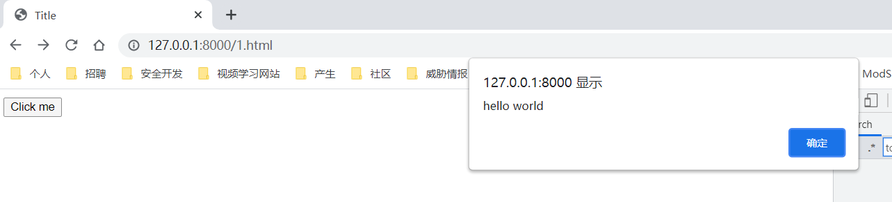

### 2、使用script标记插入脚本

#### 0x01 1.html文件

```html
<!DOCTYPE html>
<html lang="en">

<head>
    <meta charset="UTF-8">
    <title>Title</title>
</head>

<body>
<!-- 使用script标记插入脚本 -->
<script type="text/javascript">
    alert("hello world")
</script>
</body>

</html>
```

#### 0x02 结果：

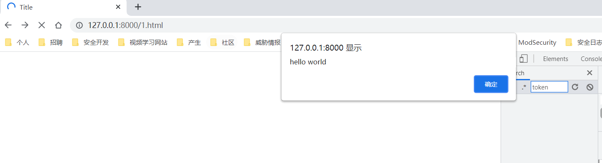

### 3、链接脚本文件（最常用）

#### 0x01 1.html文件

```html
<!DOCTYPE html>
<html lang="en">

<head>
    <meta charset="UTF-8">
    <title>Title</title>
</head>
    <!-- 链接脚本文件 -->
    <!-- 声明：哪个js文件，在访问本文件时，会去请求1.js资源 -->
    <script type="text/javascript" src="1.js"></script>
<body>
    <!-- 调用：通过onclick属性值 -->
    <input type="button" name="mybutton" value="点击一下" onclick="myfun()">
</body>

</html>
```

#### 0x02 1.js

 ```js
 function myfun(){
 	alert("oh, see you the third time!");
 	alert("Bye Bye!");     
 }
 ```

#### 0x03 实操：

#### 0x04 1.html文件

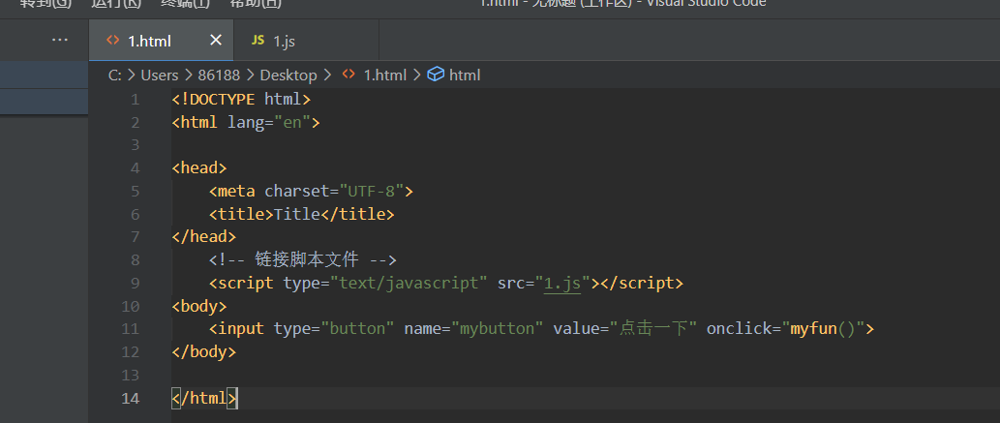 

#### 0x05 1.js文件

 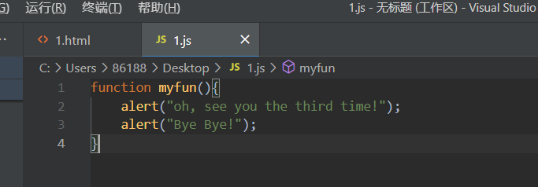

 

#### 0x06 结果：访问：http://127.0.0.1:8000/1.html，成功调用1.js文件

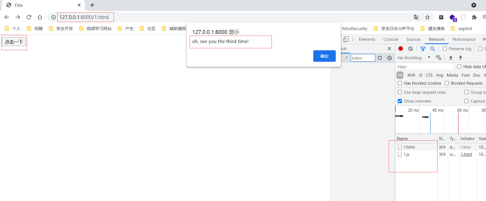 

 

## 二、JavaScript基础 

### 1、JS支持两种类型注释

(1)行注释：（//注释）

(2)快注释：（/\*注释\*/）


### 2、JS变量

#### (1)变量的声明

使用var关键字进行变量的声明：var x;

声明的时候可以同时对变量初始化：var y=4;

使用逗号将多个变量隔开：var x,y=5,z='hello';

#### (2)变量的命名

变量必须由字母，数字和下划线组成

字母或者是下划线开头，不可以是数字

变量不可以是保留字

#### (3)变量区别大小写


### 3、JS数据类型

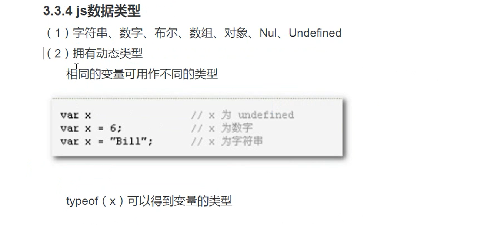

### 4、JS运算符

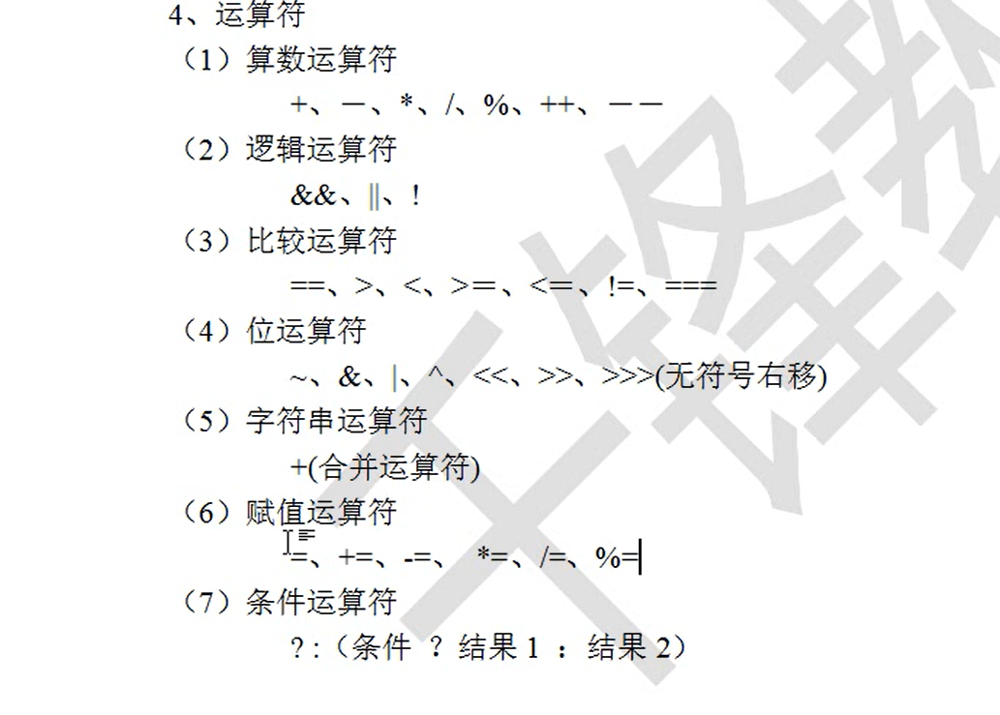

### 5、JS控制语句

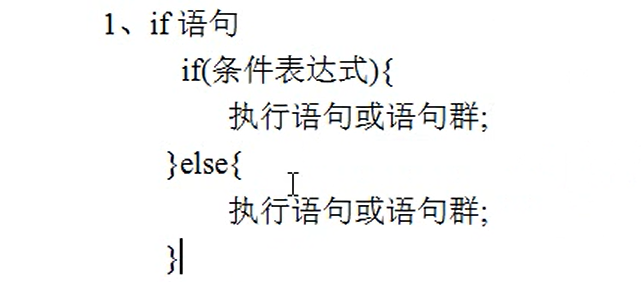


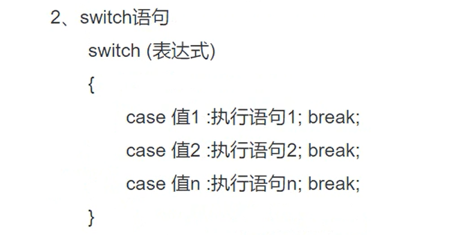


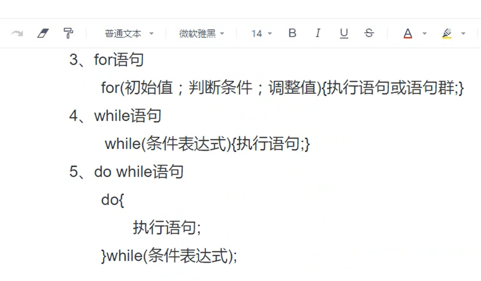

### 6、JS函数

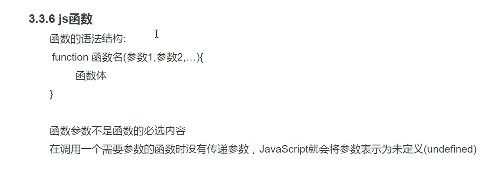

#### 0x01 例子：

1.html

```html
<!DOCTYPE html>
<html lang="en">

<head>
    <meta charset="UTF-8">
    <title>Title</title>
</head>
    <!-- 链接脚本文件 -->
    <script type="text/javascript" src="1.js"></script>
<body>
    <input type="button" name="mybutton" value="点击一下" onclick="fun1()">
</body>

</html>
```

1.js

```js
function myfun(arg){
    var a =100;
    alert(typeof(a));

    var str = arg;
    alert(str);
    return a;
}

function fun1(){
    var b ="b = ";  //js中：变量的数据类型是根据值来决定
    b+= myfun(10);  //返回的值是数字可以当作字符串使用
    alert(b)
}
```


#### 0x02 结果：

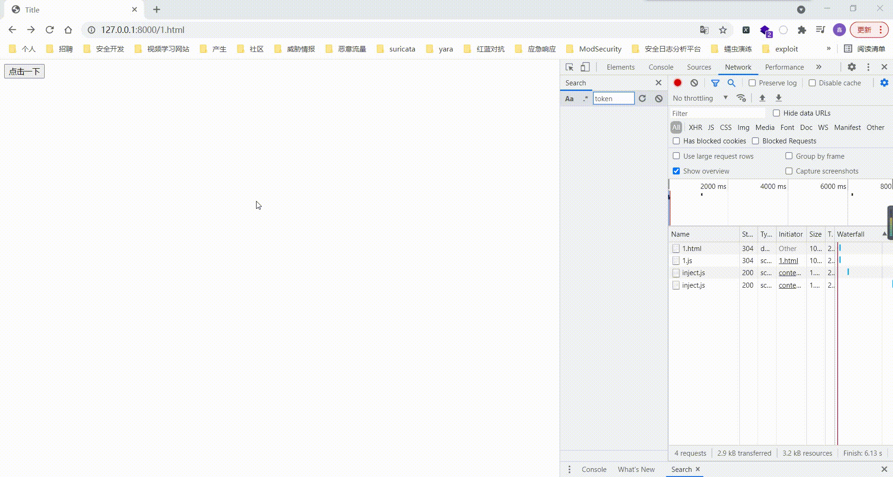


### 7、JS对象

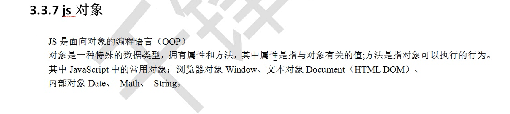

#### （1）window对象

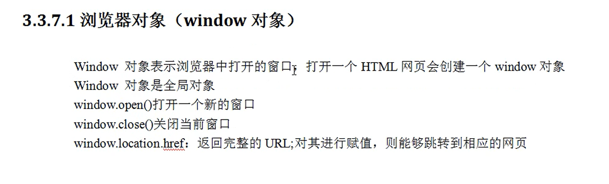

##### 0x00 举例：

##### 0x01 1.html文件

```html
<!DOCTYPE html>
<html lang="en">

<head>
    <meta charset="UTF-8">
    <title>使用windows对象</title>
</head>
    <!-- 链接脚本文件 -->
    <script type="text/javascript" src="1.js"></script>
<body>
    <input type="button" name="" value="获取当前网页的url" onclick="do_get_url()">
    <br>
    <br>
    <input type="button" name="" value="跳转网页" onclick="do_set_url()">
    <br>
    <br>
    <input type="button" name="" value="关闭当前网页" onclick="do_close_html()">
</body>

</html>
```


##### 0x02 1.js文件

```js
function do_get_url(){
    var myurl="当前网页的url:";
    myurl+=window.location.href;
    alert(myurl);

}

function do_set_url(){
    //在原网页进行网页的跳转
    window.open('http://www.baidu.com')

    //在新页面打开
    //window.open('http://www.baidu.com')

}

function do_close_html(){
    //浏览器不同，结果可能不同
    window.close();

}
```


##### 0x03 结果：

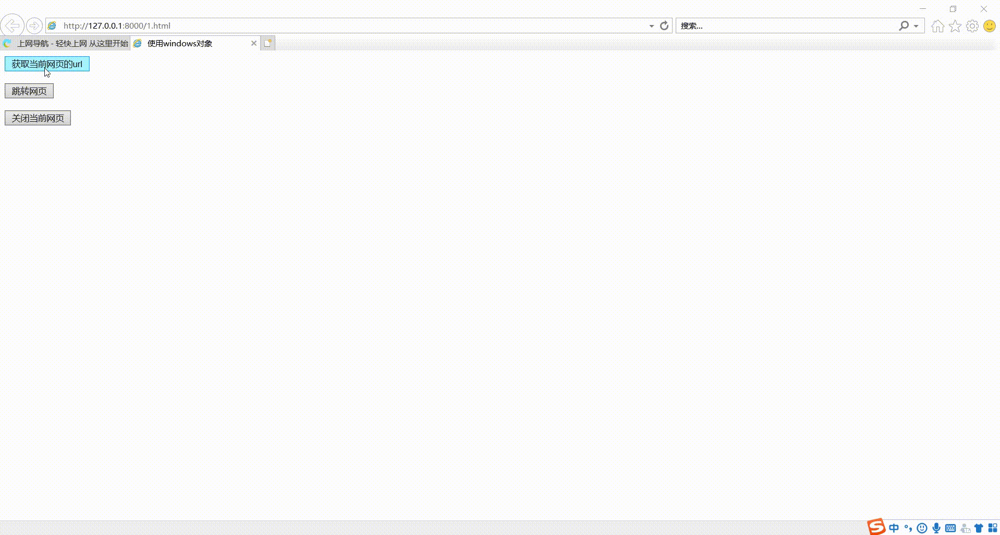


#### （2）data对象

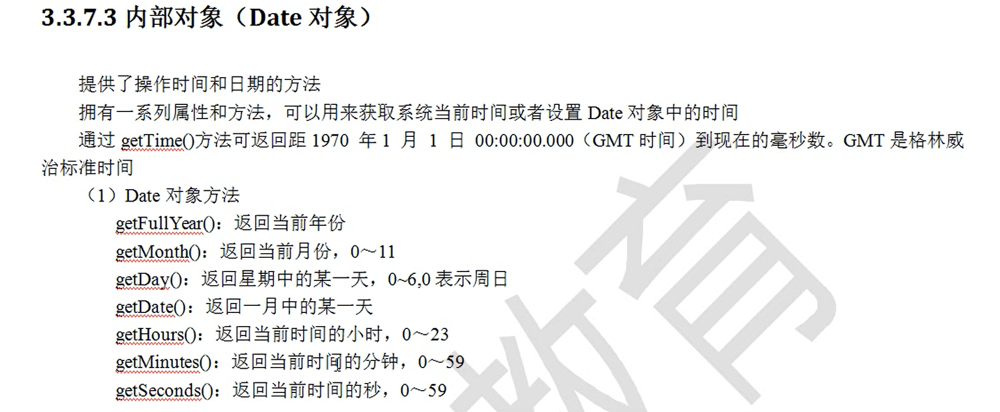

##### 0x00 举例：

##### 0x01 1.html文件

```html
<!DOCTYPE html>
<html lang="en">

<head>
    <meta charset="UTF-8">
    <title>获取当前时间</title>
</head>

    <script type="text/javascript" src="1.js"></script>
<body>

</html>
```

##### 0x02 1.js文件

```js
var d = new Date();
document.write( "<br>");
document.write("现在时间是：");
document.write(d.getFullYear());
document.write("年");
document.write(d.getMonth()+1);
document.write("月");
document.write(d.getDate());
document.write("日");
document.write(" 星期");
document.write(d.getDay()+" ");
document.write(d.getHours());
document.write("点");
document.write(d.getMinutes());
document.write("分");
document.write(d.getSeconds());
document.write("秒");
document.write("<br>");
document.write("<br>");
```


##### 0x03 结果：

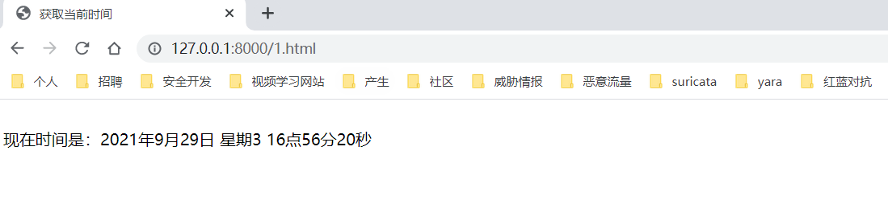

#### （3）setTimeout函数和setInterval函数

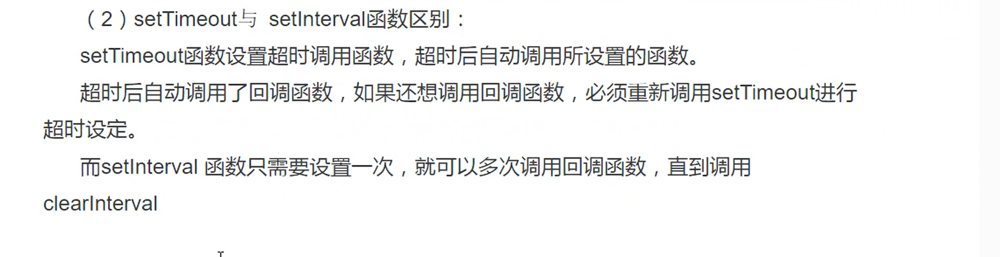


##### 0x00 举例：

##### 0x01 1.html文件

```html
<!DOCTYPE html>
<html lang="en">

<head>
    <meta charset="UTF-8">
    <title>从当前时间开始计时</title>
</head>

    <script type="text/javascript" src="1.js"></script>
<body onload="start_onload()"> <!--onload属性用于设置后面js语句:start_onload()在页面打开时就立即执行,相当于点了一下开始按钮-->
    <div align="center">
        <h1>Qfedu Timer</h1>
        <input type="text" id="time">
        <br>
        <br>
        <input type="button" value="开始" onclick="start()">
        <input type="button" value="暂停" onclick="stop()">

    </div>
</html>
```


##### 0x02 1.js文件

```js
var stop_flag = 0;

function zidingyi() {

    var time = new Date();
    var h = time.getHours();
    var m = time.getMinutes();
    var s = time.getSeconds();
    document.getElementById('time').value = h + ":" + m + ":" + s;
    stop_flag = setTimeout("zidingyi()", 1000);   //setTimeout():设置用浏览器访问url时,经过1秒钟后，自动调用传参传入的函数名，称为回调函数,过1秒后只执行一次，而setInterval()函数每过1秒钟，就执行一次回调函数，本次重复调用自己，每过1秒也执行一遍setTimeout

}

function start_onload() {
    zidingyi();
}

function start() {
    zidingyi();

}

function stop() {

    clearTimeout(stop_flag);   //理解为释放setTimeout对象

}
```


##### 0x03 结果：

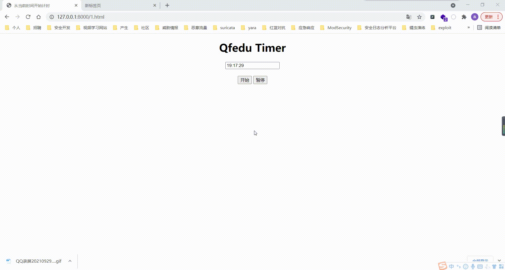


#### （4）Math对象

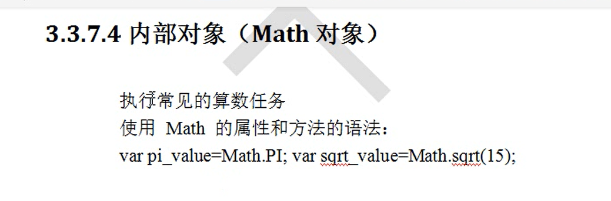

##### 0x00 举例：

##### 0x01 html文件

```html
<!DOCTYPE html>
<html lang="en">

<head>
    <meta charset="UTF-8">
    <title>简易计算器</title>
</head>

    <script type="text/javascript" src="1.js"></script>
<body> 
    <div align="center">
        <h2>简易计算器</h2>
        <br>
        <br>
        num1:<input type="text" id="num1">
        <br>
        <br>
        num2:<input type="text" id="num2">
        <br>
        <br>
        结果:<input type="text" id="ret">
        <br>
        <br>
        <input type="button" value="最大值" onclick="mymath(1)">
        &nbsp;
        <input type="button" value="最小值" onclick="mymath(2)">
        &nbsp;
        <input type="button" value="加法" onclick="mymath(3)">
        &nbsp;
        <input type="button" value="减法" onclick="mymath(4)">
    </div>
</html>
```


##### 0x02 js文件

```js
function mymath(arg){

    //获取文本内容
    var num1 = document.getElementById("num1").value;
    var num2 =document.getElementById("num2").value;
    //判断是否是数字
    if (isNaN(num1) || isNaN(num2))
    {

        alert("请输入数字!")

    }
    else
    {

        switch(arg)
        {

            case 1:
                document.getElementById('ret').value=Math.max(num1,num2);
            break;
            case 2:
                document.getElementById('ret').value=Math.min(num1,num2);
            break;
            case 3:
                document.getElementById('ret').value=Number(num1) + Number(num2);
            break;
            case 4:
                document.getElementById('ret').value=Number(num1) - Number(num2);
            break;
        }
    }
}
```


##### 0x03 结果：

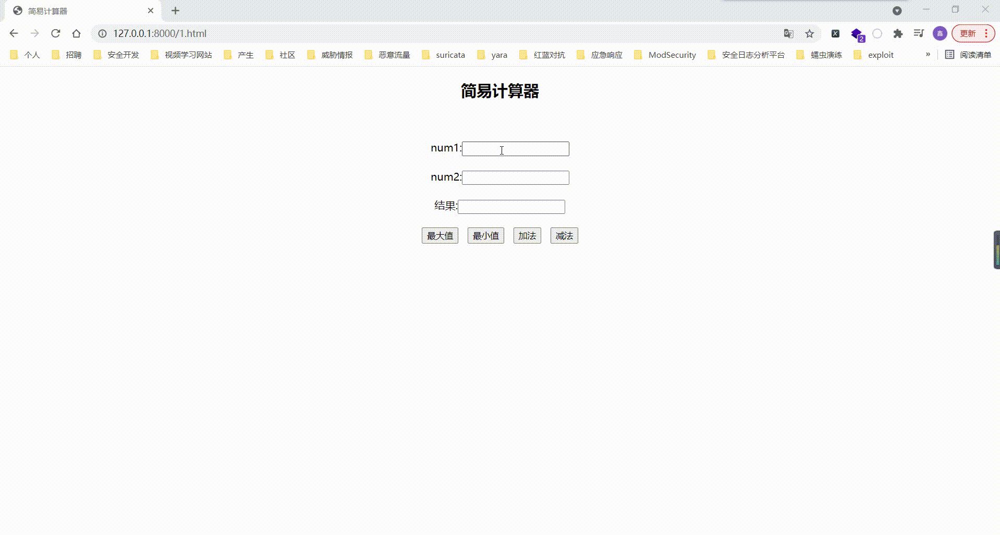


#### （5）String对象

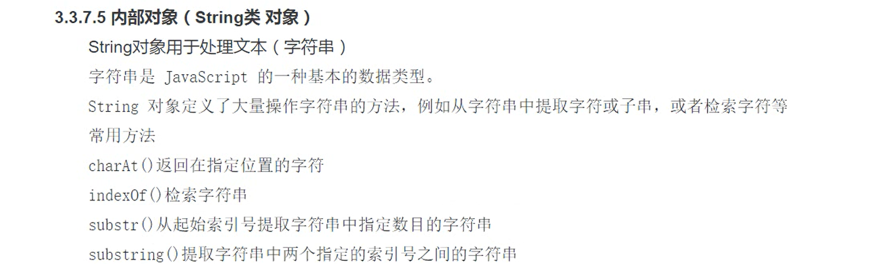

##### 0x00 例子：字符串本身就是一个对象

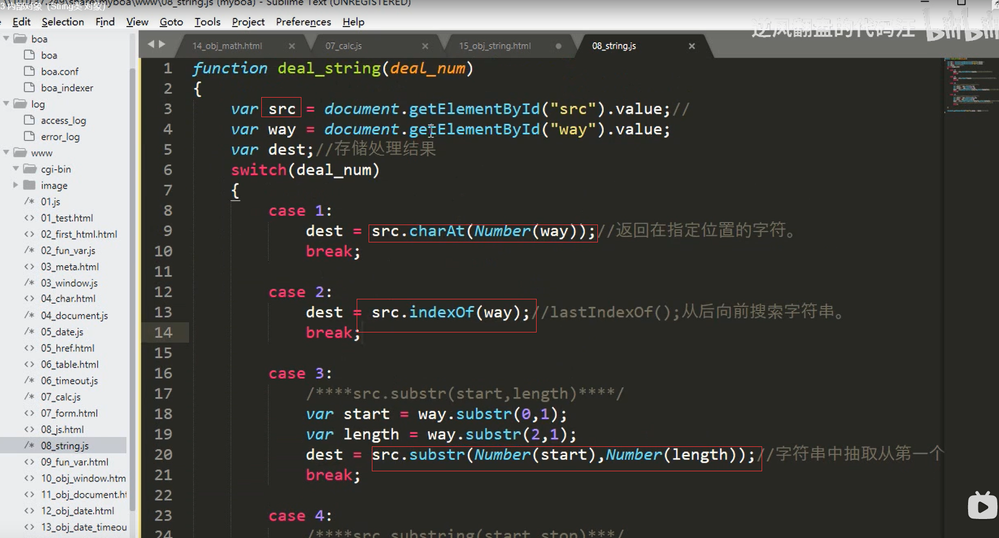


#### （6）全局函数

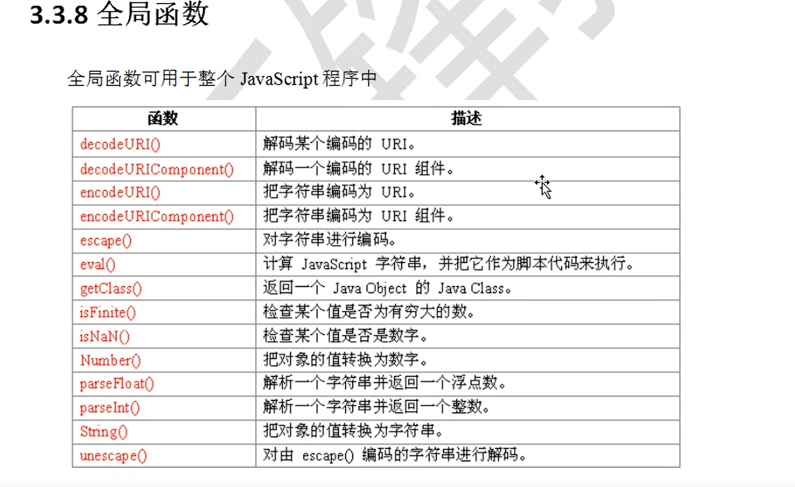


## 三、ajax局部更新网页流程图：浏览器操作服务器

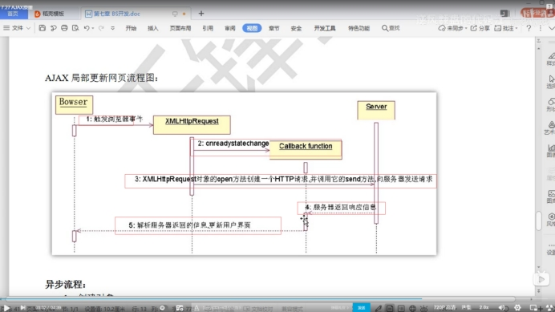 

 

### 1、流程

1、创建XMLHttpRequest对象

2、设置回调函数

3、Open创建服务器请求

4、Send向服务器发送请求

5、服务器有结果会自动调用fun回调函数

在回调函数里面根据服务器返回的响应信息，更新用户界面

 

### 2、根据不同的浏览器插件异步请求对象：

```js
function get_xmlreq()
{
    var xmlhttp=null;
    if(window.XMLHttpRequest)//自动检测当前浏览器的版本，如果是IE5.0以上的高版本的浏览器
    {//code for IE7+,Firefox,Chrome,Opera,Safari
        xmlhttp=new XMLHttpRequest();
    }
    else//如果浏览器是低版本
    {
        xmlhttp =new ActiveXObject('Microsoft.XMLHTTP');//创建请求对象
    }
    return xmlhttp;
}
```

在js文件中开始定义这个函数，其他js函数直接调用就能创建一个异步请求对象

 

### 3、标准的XMLHttpRequest属性

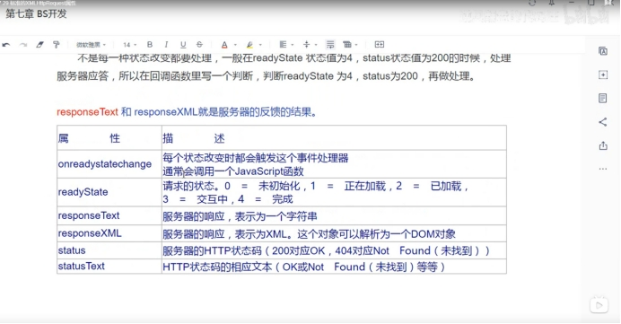 

 

### 4、标准的XMLHttpRequest方法

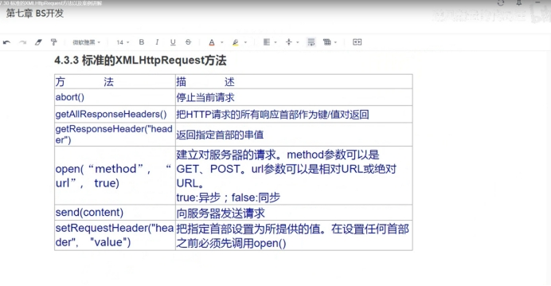 

 

### 5、异步流程：

1、创建对象

2、设置回调函数，fun函数

3、open创建服务器请求

4、send向服务器发送请求

5、服务器有结果会自动调用fun回调函数

 

### 6、同步流程：（很少用到）

1、创建对象

2、open建立对服务器的请求

3、Send向服务器发送请求

4、fun函数处理，服务器返回结果

 

### 7、举例：通过ajax，浏览器获取服务器端指定的文件内容

#### 0x01 1.html文件

```html
<!DOCTYPE html>
<html lang="en">

<head>
    <meta charset="UTF-8">
    <title>获取服务器指定文件内容</title>
</head>

    <script type="text/javascript" src="1.js"></script>
<body>
<div align="center">
    <h2>获取服务器指定文件内容</h2>
    <br>
    <br>
    <input type="button"  value="发送请求" onclick="myfun()">
    <br>
    <br>
    <label id="mylabel">^_^</label>
</div>

</body>

</html>
```

#### 0x02 1.js文件

```js
function get_xmlreq()
{
    var xmlhttp=null;
    if(window.XMLHttpRequest)//自动检测当前浏览器的版本，如果是IE5.0以上的高版本的浏览器
    {//code for IE7+,Firefox,Chrome,Opera,Safari
        xmlhttp=new XMLHttpRequest();
    }
    else//如果浏览器是低版本
    {
        xmlhttp =new ActiveXObject('Microsoft.XMLHTTP');//创建请求对象
    }
    return xmlhttp;
}

function myfun()
{ //创建XMLHttpRequest对象
	// alert("oh, see you the third time!");
	// alert("Bye Bye!");  
    
    var xmlhttp=null;
    xmlhttp=get_xmlreq();
    //设置回调函数并结构服务器的状态
    xmlhttp.onreadystatechange=function()
    {
        //如果服务器的状态为4表示完成，状态码为200表示OK,则可以获取服务器返回的数据
        if(xmlhttp.readyState==4 && xmlhttp.status==200)
        {

            //获取数据并对网页执行局部的操作
            var ret=xmlhttp.responseText;
            //ret接收数据
            document.getElementById('mylabel').innerHTML=ret;  //将ret数据写入到mylabel标签

        }    
    
    }
    //创建http请求，并发送请求服务器
    //创建http请求
    xmlhttp.open("GET",'file.txt',true)
    //清理缓存
    xmlhttp.setRequestHeader("If-Modified-Since","0");
    //发送请求
    xmlhttp.send();

}
```

#### 0x03 file.txt文件

```txt
hello world
```


#### 0x04 结果：

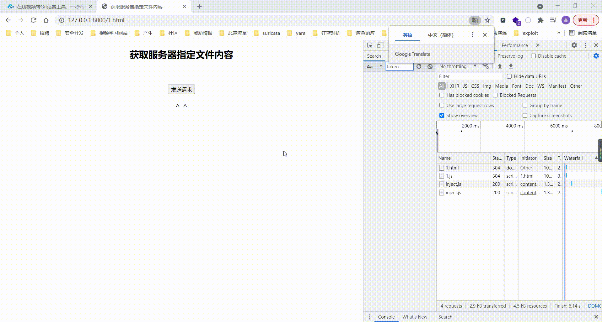


##  四、CGI编程


### 1、什么是CGI?

在我们网页端没有办法直接运行C程序，网页端：html，js,ajax都没有问题，但是C语言不行，通过CGI可以服务器与硬件沟通

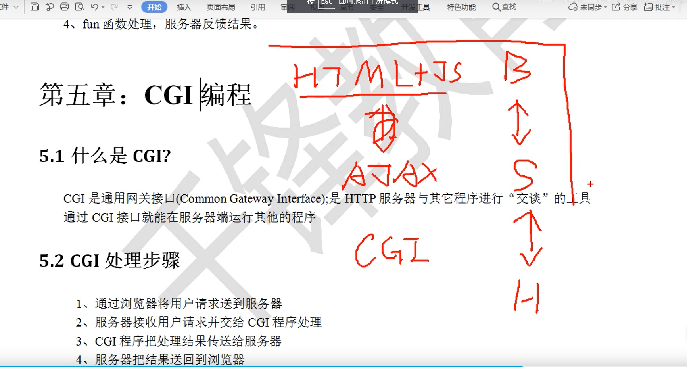


CGI可以用任何一种语言编写，只要这种语言具有标准输入，标准输出，和获取环境变量

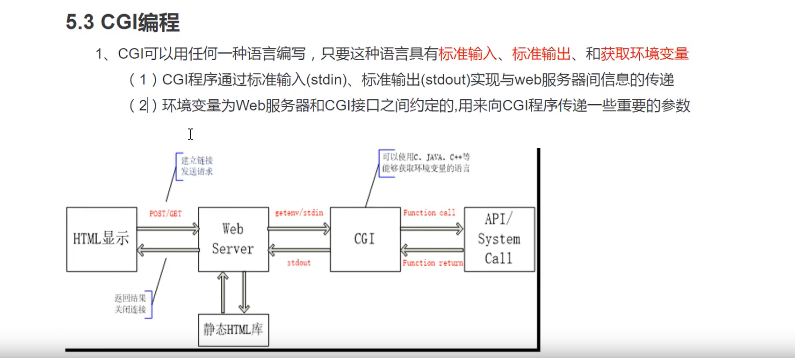

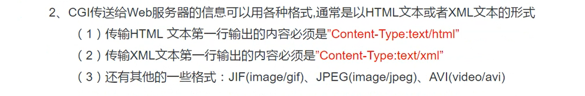


### 2、举例：

#### 0x01 利用python2.7开启http服务

```shell
root@VM-0-10-centos www]# python2.7  -m CGIHTTPServer
```


#### 0x02 cgi.html文件

```html
<!DOCTYPE html>
<html lang="en">
<head>
    <meta charset="UTF-8">
    <title>案例1：cgi测试</title>
</head>
<body>
	<FORM ACTION="./cgi-bin/cgi1.cgi">
		<P>这是第一个CGI测试程序
			<br>
		<INPUT TYPE='SUBMIT' VALUE="确定">
	</FORM>
</body>
</html>

```


#### 0x03 cgi.c文件

```c
#include <stdio.h>

int main(void)
{
	//cgi程序中的第一行必须是以下这个
	printf("Content-Type: text/html;charset=utf-8\r\n\r\n");

	printf("<html>\n<TITLE>CGI1:CGI hello!</TITLE>");
	printf("<center><H1>hello,祥祥你好 </H1></center>\n");
	printf("<center><H1>hello,this is first CGI demo! </H1></center>\n</html>");
	return 0;
}
```


#### 0x04 编译cig.c文件

```shell
gcc cgi.c -o cgi1.cgi
```

cgi程序编译完毕后，必须以.cgi作为可执行文件的后缀名


#### 0x05 目录结构如下：

```shell
www/
├── cgi-bin
│   ├── cgi1.cgi
│   └── cgi.c
└── cgi.html
```


#### 0x06 结果：

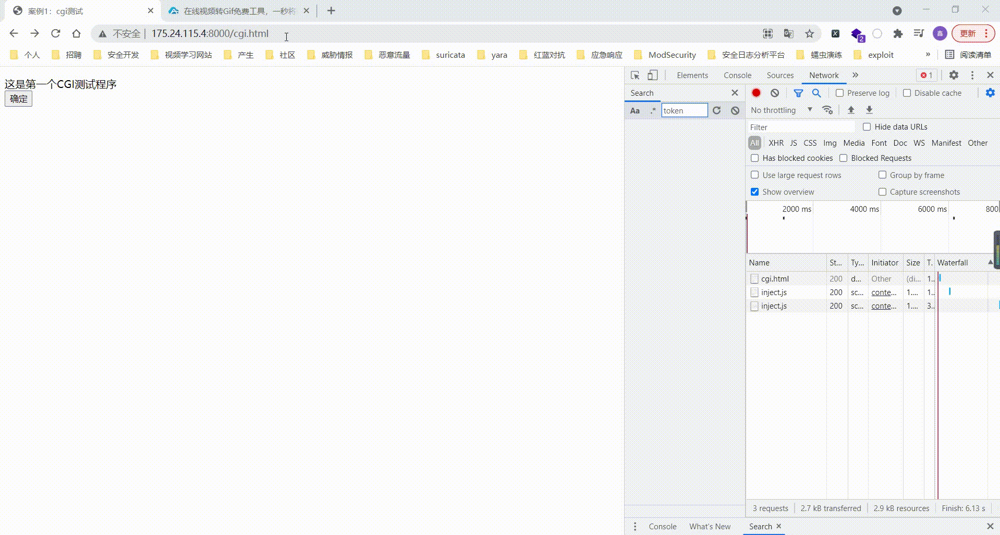


### 3、案例2：以get形式发送内容

#### 0x01 cgi.html文件

```html
<!DOCTYPE html>
<html lang="en">

<head>
	<meta charset="UTF-8">
	<title>案例2：以get形式发生请求</title>
</head>

<script type="text/javascript" src="cgi.js"></script>

<body>
	data1:<input type="text" id="data1" />
	<br>
	data2:<input type="text" id="data2" />
	<br>
	<br>
	result:<label id="result"></label>
	<br>
	<br>
	<input type="button" id="add" value="相加" onclick="calc(0)" />
	<input type="button" id="minus" value="相减" onclick="calc(1)" />
</body>

</html>
```


#### 0x02 cgi.js文件

```js
function calc(action) {

    if (isNaN(document.getElementById("data1").value) || isNaN(document.getElementById("data2").value)) {

        alert("请输入有效的数字！");
        document.getElementById("data1").value = '';
        document.getElementById("data2").value = '';

    }
    else {

        var sendData = "";
        sendData += (document.getElementById("data1").value);
        if (0 == action) {
            sendData += "+";   //5+
        }
        else if (1 == action) {

            sendData += "-";  //5-

        }
        sendData += (document.getElementById("data2").value); //5+6 或 5-6
        loadData(sendData);        //sendData:5+6

    }

}
function getXMLHttpRequest() {

    var xmlhttp = null;
    if (window.XMLHttpRequest)//自动检测当前浏览器的版本，如果是IE5.0以上的高版本的浏览器
    {//code for IE7+,Firefox,Chrome,Opera,Safari
        xmlhttp = new XMLHttpRequest();
    }
    else//如果浏览器是低版本
    {
        xmlhttp = new ActiveXObject('Microsoft.XMLHTTP');//创建请求对象
    }
    return xmlhttp;

}

function loadData(sendData) {      //sendData:5+6

    var xmlhttp = null;
    var url = "/cgi-bin/cgi2.cgi?";
    url += sendData;            //url:/cgi-bin/cgi2.cgi?5+6

    //创建XMLHttpRequest对象
    xmlhttp = getXMLHttpRequest();

    //设置回调函数
    xmlhttp.onreadystatechange = function () {

        if (xmlhttp.readyState == 4 && xmlhttp.status == 200) {
            document.getElementById("result").innerHTML = xmlhttp.responseText;

        }

    }
    xmlhttp.open('GET', url, true);
    xmlhttp.setRequestHeader('If-Modified-Since', '0'); //清楚缓存
    xmlhttp.send();


}
```

#### 0x03 cgi2.c文件

```c
#include <stdio.h>
#include <stdlib.h>

int main(void)
{

    char *data = NULL;
    float a = 0.0, b = 0.0;
    char c = 0;
    //必不可少的第一步语句
    printf("content-type:text/html\n\n");

    //获取从服务器接收的数据
    data = getenv("QUERY_STRING");   //data: 5=6
    if (NULL == data)
    {

        printf("error");
        return 0;
    }

    sscanf(data, "%f%c%f", &a, &c, &b);
    if ('+' == c)
    {

        printf("%f", a + b);
    }
    else if ('-' == c)
    {

        printf("%f", a - b);
    }
    else
    {

        printf("error");
    }
    return 0;
}
```


#### 0x04 编译cgi2.c文件

```shell
[root@VM-0-10-centos cgi-bin]# gcc cgi2.c -o cgi2.cgi
```


#### 0x05 目录结构如下：

```shel
www
├── [drwxr-xr-x]  cgi-bin
│   ├── [-rw-r--r--]  cgi2.c
│   └── [-rwxr-xr-x]  cgi2.cgi
├── [-rw-r--r--]  cgi.html
└── [-rw-r--r--]  cgi.js

```


#### 0x06 结果：

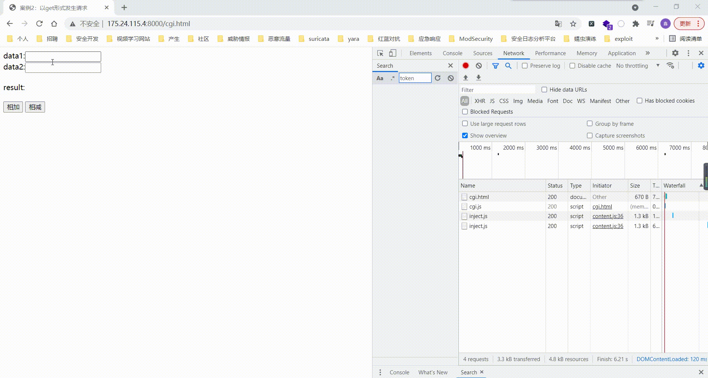


### 4、案例3：以post形式发送请求

#### 0x01 ajax.html文件

```html
<!DOCTYPE html>
<html lang="en">

<head>
	<meta charset="UTF-8">
	<title>案例3：以post形式发生请求</title>
</head>

<script type="text/javascript" src="cgi.js"></script>

<body>
	data1:<input type="text" id="data1" />
	<br>
	data2:<input type="text" id="data2" />
	<br>
	<br>
	result:<label id="result"></label>
	<br>
	<br>
	<input type="button" id="add" value="相加" onclick="calc(0)" />
	<input type="button" id="minus" value="相减" onclick="calc(1)" />
</body>

</html>
```

#### 0x02 cgi.js文件

```js
function calc(action) {

    if (isNaN(document.getElementById("data1").value) || isNaN(document.getElementById("data2").value)) {

        alert("请输入有效的数字！");
        document.getElementById("data1").value = '';
        document.getElementById("data2").value = '';

    }
    else {

        var sendData = "";
        sendData += (document.getElementById("data1").value);
        if (0 == action) {
            sendData += "+";   //5+
        }
        else if (1 == action) {

            sendData += "-";  //5-

        }
        sendData += (document.getElementById("data2").value); //5+6 或 5-6
        loadData(sendData);        //sendData:5+6

    }

}
function getXMLHttpRequest() {

    var xmlhttp = null;
    if (window.XMLHttpRequest)//自动检测当前浏览器的版本，如果是IE5.0以上的高版本的浏览器
    {//code for IE7+,Firefox,Chrome,Opera,Safari
        xmlhttp = new XMLHttpRequest();
    }
    else//如果浏览器是低版本
    {
        xmlhttp = new ActiveXObject('Microsoft.XMLHTTP');//创建请求对象
    }
    return xmlhttp;

}

function loadData(sendData) {      //sendData:5+6

    var xmlhttp = null;
    var url = "/cgi-bin/cgi3.cgi";

    //创建XMLHttpRequest对象
    xmlhttp = getXMLHttpRequest();

    //设置回调函数
    xmlhttp.onreadystatechange = function () {

        if (xmlhttp.readyState == 4 && xmlhttp.status == 200) {
            document.getElementById("result").innerHTML = xmlhttp.responseText;

        }

    }
    xmlhttp.open('POST', url, true);
    xmlhttp.setRequestHeader('If-Modified-Since', '0'); //清楚缓存
    xmlhttp.send(sendData);


}
```


#### 0x03 cgi3.c文件

```c
#include <stdio.h>
#include <stdlib.h>

int main(void)
{

    char *dataLen = NULL,buff[100] = {0};
    float a = 0.0, b = 0.0;
    char c = 0;
    int len= 0;
    //必不可少的第一步语句
    printf("content-type:text/html\n\n");


    dataLen = getenv("CONTENT_LENGTH");   
    if (NULL == dataLen)
    {

        printf("error1");
        return 0;
    }
    else
    {
        len = atoi(dataLen);
        if(len>0)
        {
            if(NULL ==fgets(buff,len+1,stdin))  //fget获取数据：buff==5+6
            {

                    printf("error2");
                    return 0;

            } 
            else
            {

                sscanf(buff, "%f%c%f", &a, &c, &b);
                if ('+' == c)
                {

                    printf("%f", a + b);
                }
                else if ('-' == c)
                {

                    printf("%f", a - b);
                }
                else
                {

                    printf("error3");
                }   
            }   

        }

    }
    return 0;
}
```


#### 0x04 编译cgi3.c文件

```shell
[root@VM-0-10-centos cgi-bin]# gcc cgi3.c -o  cgi3.cgi
```


#### 0x05 目录结构如下：

```shell
/home/www/
├── [drwxr-xr-x]  cgi-bin
│   ├── [-rw-r--r--]  cgi3.c
│   └── [-rwxr-xr-x]  cgi3.cgi
├── [-rw-r--r--]  cgi.html
└── [-rw-r--r--]  cgi.js
```

#### 0x06 结果：

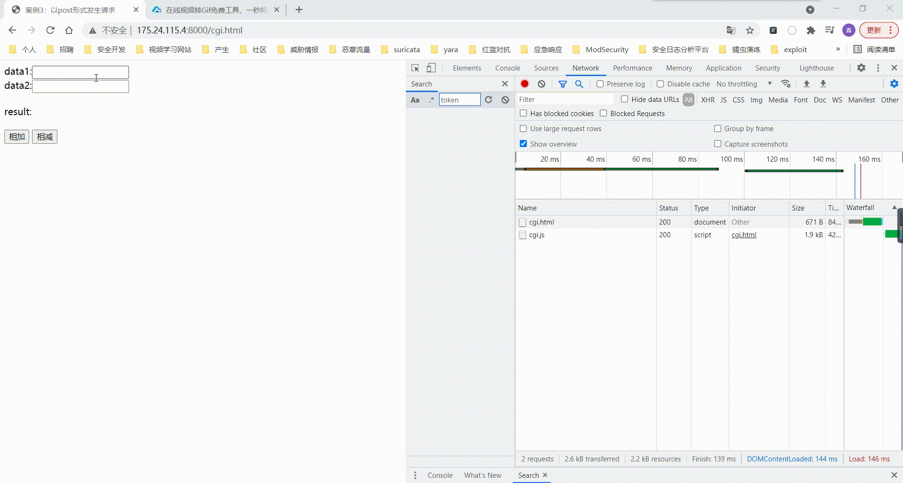


