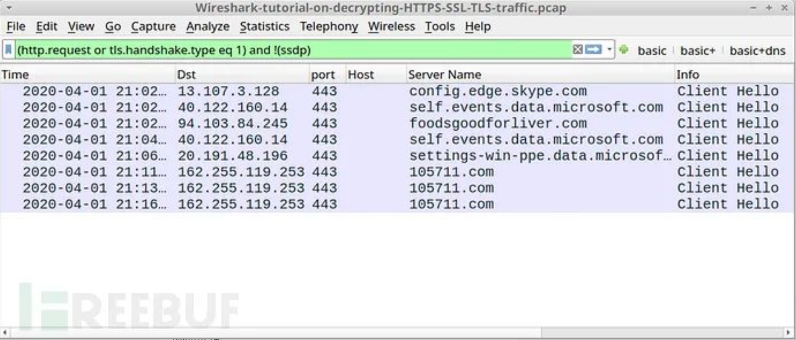
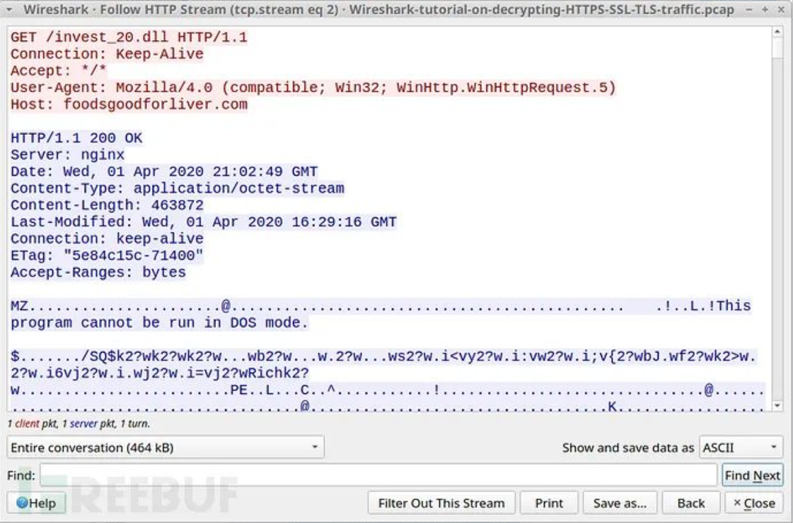

# Wireshark解密HTTPS流量

2020-09-04阅读 8900

在审查可疑网络活动时，经常遇到加密流量。大多数网站使用HTTPS协议，各种类型的恶意软件也使用HTTPS，查看恶意软件产生的数据对于了流量内容非常有帮助。

本文介绍了如何利用Wireshark从pcap中解密HTTPS流量。可以使用基于文本的日志进行解密方法，日志中包含最初记录pcap时捕获的加密密钥数据。

## **HTTPS Web流量**

HTTPS流量通常显示一个域名。例如，在Web浏览器中查看https://www.wireshark.org，在自定义的Wireshark列显示中查看时，pcap将显示www.wireshark.org作为此流量的服务器名称。但无法知道其他详细信息，例如实际的URL或从服务器返回的数据。


## **加密密钥日志文件**

加密密钥日志是一个文本文件。


最初记录pcap时，使用中间人（MitM）技术创建这些日志。如果在记录pcap时未创建任何此类文件，则无法解密该pcap中的HTTPS通信。

## **示例分析**

### **有密钥日志文件的HTTPS流量**

Github存储库中有一个受密码保护的ZIP文件，其中包含pcap及其密钥日志文件。ZIP中包含的pcap通过密钥日志解密后，可以访问恶意软件样本。

链接：

https://github.com/pan-unit42/wireshark-tutorial-decrypting-HTTPS-traffic


从ZIP（密码：infected）中提取pcap和密钥日志文件：

```javascript
Wireshark-tutorial-KeysLogFile.txt
Wireshark解密HTTPS-SSL-TLS-traffic.pcap教程
```


### **没有密钥日志文件的HTTPS流量**

在Wireshark中打开解密的HTTPS-SSL-TLS-traffic.pcap Wireshark教程，使用Web筛选器：

> （http.request或tls.handshake.type eq 1）和！（ssdp）

此pcap来自Windows 10主机上的Dridex恶意软件，所有Web流量（包括感染活动）都是HTTPS。没有密钥日志文件，看不到流量的任何详细信息，只有IP地址，TCP端口和域名：



### **加载密钥日志文件**

在Wireshark中打开解密的HTTPS-SSL-TLS-traffic.pcap Wireshark，使用菜单路径Edit –> Preferences来打开Preferences菜单：


在Preferences菜单的左侧，单击Protocols：


如果使用的是Wireshark版本2.x，需要选择SSL。如果使用的是Wireshark 3.x版，需要选择TLS。选择SSL或TLS后，可以看到（Pre）-Master-Secret日志文件名。单击“浏览”，然后选择名为Wireshark-tutorial-KeysLogFile.txt的密钥日志文件：


### **密钥日志文件的HTTPS流量**

单击“确定”后，Wireshark会在每条HTTPS行下列出解密的HTTP请求：


在此pcap中可以看到隐藏在HTTPS通信中对microsoft.com和skype.com域的HTTP请求，还发现由Dridex发起的以下流量：

```javascript
foodsgoodforliver[.]com – GET /invest_20.dll
105711[.]com – POST /docs.php
```

对foodsgoodforliver[.]com的GET请求返回了Dridex的DLL文件。对105711[.]com的POST请求是来自受Dridex感染的Windows主机的命令和控制（C2）通信。

针对foodsgoodforliver[.]com的HTTP GET请求的HTTP流：




可以从pcap导出此恶意软件，使用菜单路径文件–>导出对象–> HTTP从pcap导出该文件：


使用file命令确认这是一个DLL文件，然后使用shasum -a 256获取文件的SHA256哈希：


该恶意软件的SHA256哈希为：

```javascript
31cf42b2a7c5c558f44cfc67684cc344c17d4946d3a1e0b2cecb8e*173cb2f
```

还可以检查来自此Dridex感染的C2流量，下图显示了其中一个HTTP流的示例：


## **参考链接**

https://cloud.tencent.com/developer/article/1692440

