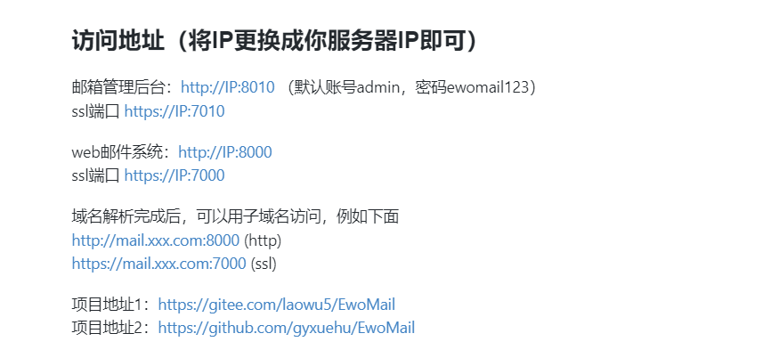
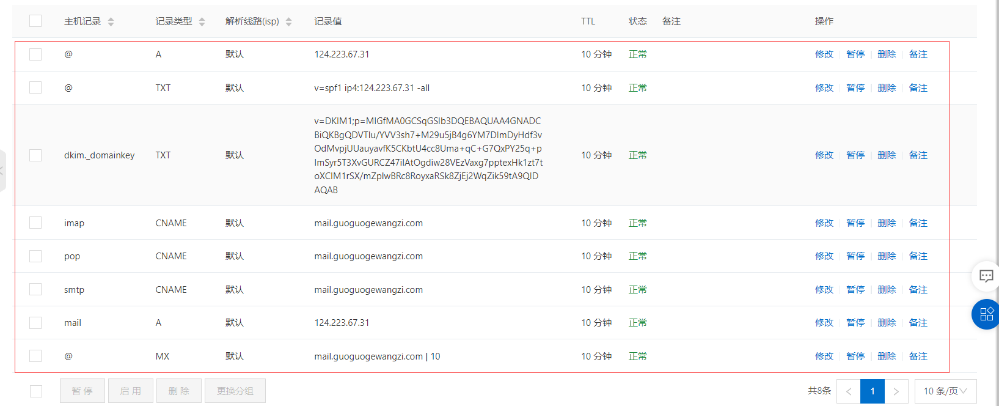
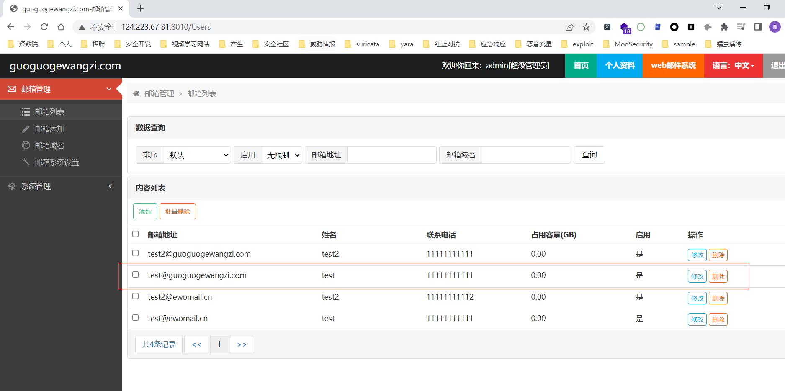

ewomail安装：

ewomail访问地址：

/etc/hosts设置

域名解析设置

`telnet smtp.qq.com 25`测试

修改gophish配置文件：`config.json`,将127.0.0.1改为：0.0.0.0:3333，0.0.0.0:80改为0.0.0.0:81为了与ewomail的web客户单80端口错开

gophish登录

启动时，存在用户名:`admin`,密码:`3529d8a5288cfc1c`

gophish设置

解释：

Name:随便填

From:发邮件人

该发件人存在ewomail邮件服务器中的邮件r人：test@guoguogewangzi.com

Host:发邮件的邮件服务器

Password:刚刚填写的发件人的邮件登录密码

收件人：`879086359@qq.com`,发送成功

数据包：邮件服务器`10.2.12.6（内网ip）`向`218.19.148.195:25（smtp.*.com:25）`发包

总结，gophish利用自搭平台ewomail邮件服务器，创建的邮件账号：test@guoguogewangzi.com，向收件人:879086359@qq.com,发送邮件，邮件内容可含恶意链接，故称钓鱼

利用smtp.qq.com:25服务器发送钓鱼邮件

password：需发送短获取，发送之后点击我已发送，显示码出来后，然后再点击确定

发送成功，可以自己发给自己

参考：

https://www.freebuf.com/articles/web/260391.html

https://github.com/gyxuehu/EwoMail

安装ewomail

http://doc.ewomail.com/docs/ewomail/install

内部通信

http://doc.ewomail.com/docs/ewomail/local_con