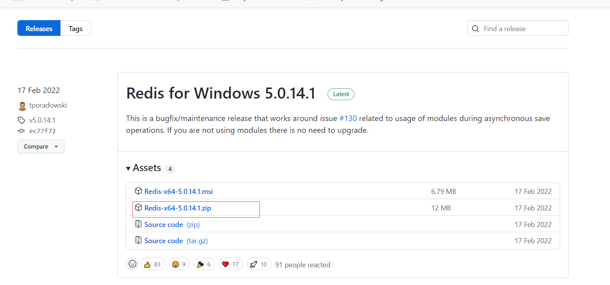
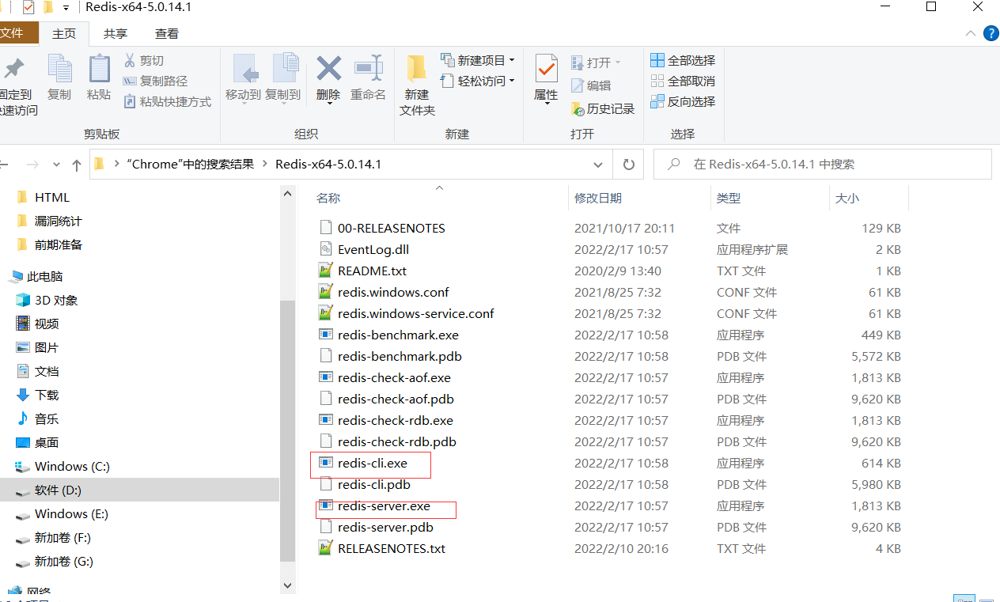
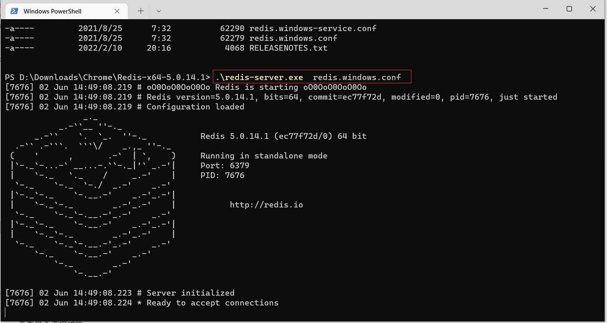
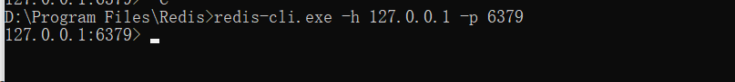
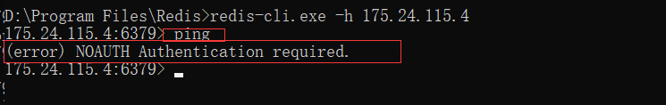
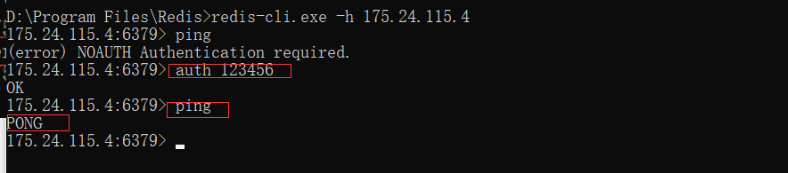

安装

参考：
https://www.runoob.com/redis/redis-install.html

Windows版下载地址：
https://github.com/tporadowski/redis/releases

如：
Redis-x64-5.0.14.1.zip

解压即可用：

启动服务器：
redis-server.exe redis.windows.conf

客户端连接
redis-cli.exe -h 127.0.0.1 -p 6379

连接成功：

连接不成功，如：

身份认证，auth+密码

