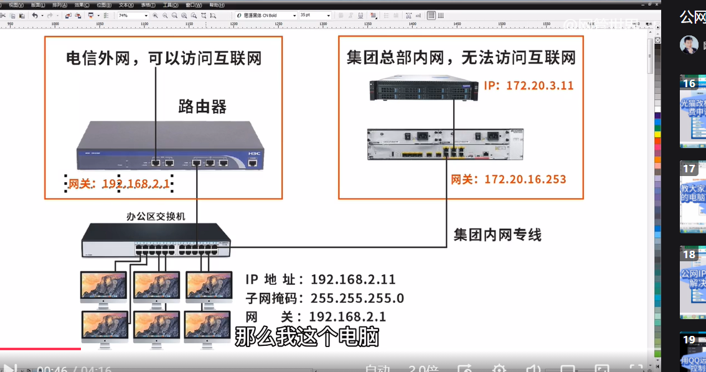
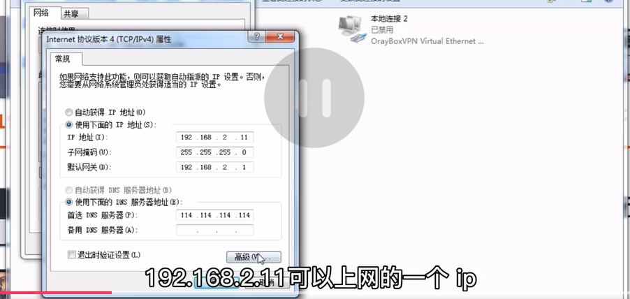
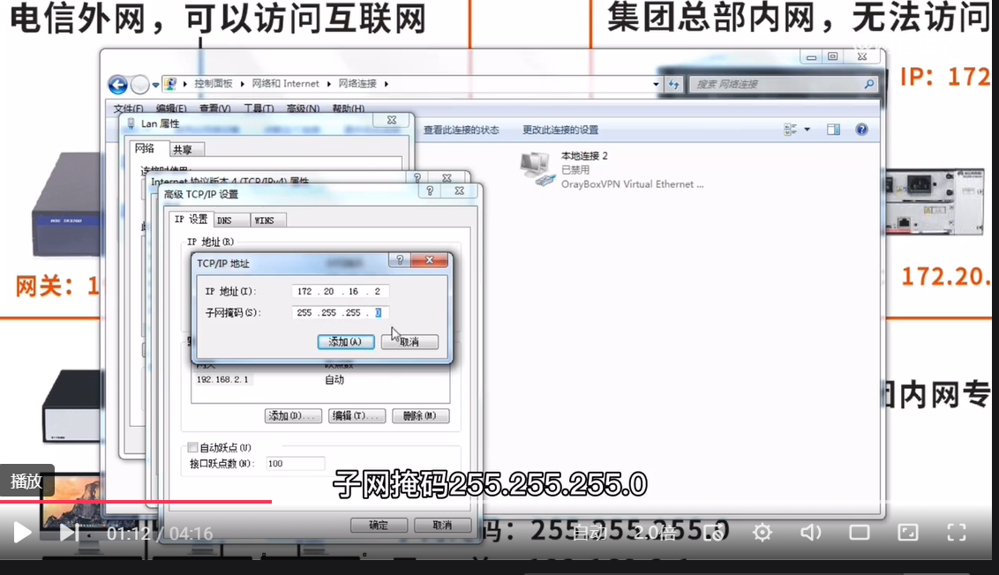
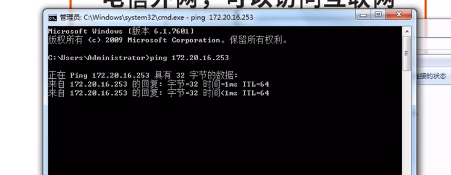
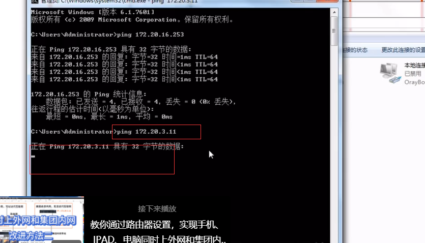
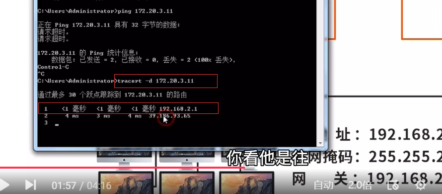
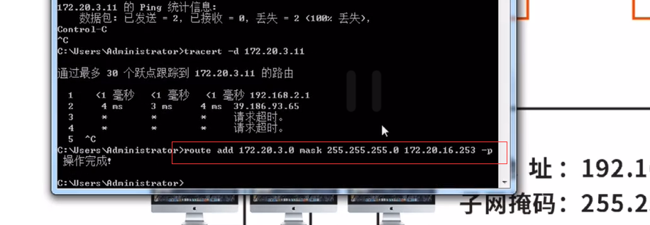
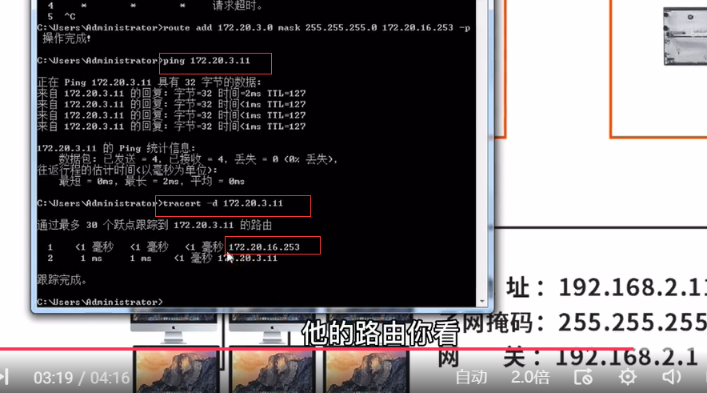

# 即可访问内网又可访问外网


**0x01 拓扑图：**

网段一：电信外网：192.168.2.0/24

网段二：集团内网专线：172.20.16.0/24




**0x02 这是可以上网的ip:192.168.2.11**




**0x03 点击高级,添加ip:172.20.16.2**




**0x04 即可ping该网关：172.20.16.253**

```shell
ping 172.20.16.253
```




**0x05 此时ping不通集团内网ip:172.20.3.11**

```
ping 172.20.3.11
```





**0x06 因为跟踪路由发现，网关走的是:192.168.2.1**

```shell
tracert -d 172.20.3.11
```





**0x07 因此需要添加路由，告诉机器访问：172.20.3.0/24网段时，走网关：172.20.16.253**

```shell
route add 172.20.3.0 mask 255.255.255.0 172.20.16.253 -p

解释：
172.20.3.0：目标：将要访问的目标网段
172.20.16.253：网关：访问目标网络需要走的网关
255.255.255.0：子网掩码
-p：表示永久路由

route print -4   #可通过该命令查看IPV4路由表
route delete  172.20.3.0   #可通过该命令删除刚刚添加的永久路由，参数：delte+目的网段网络地址
```




**0x08 添加成功，成功ping通目标ip:172.20.3.11，并再次追踪路由，可以看到，走的网关是刚刚添加的ip：172.20.16.253**

```shell
ping 172.20.3.11
tracert -d 172.20.3.11
```




这个方法有个缺点：

每台电脑都要设置双ip以及静态路由，电脑多的话设置起来太麻烦，还有改进的方法！


**结束!**